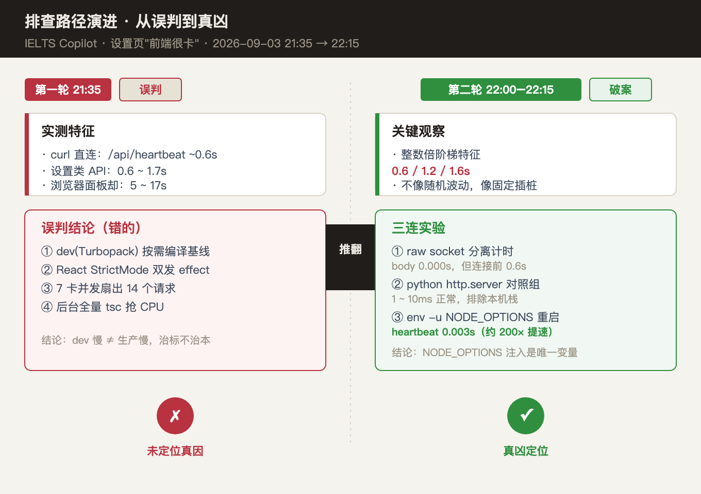
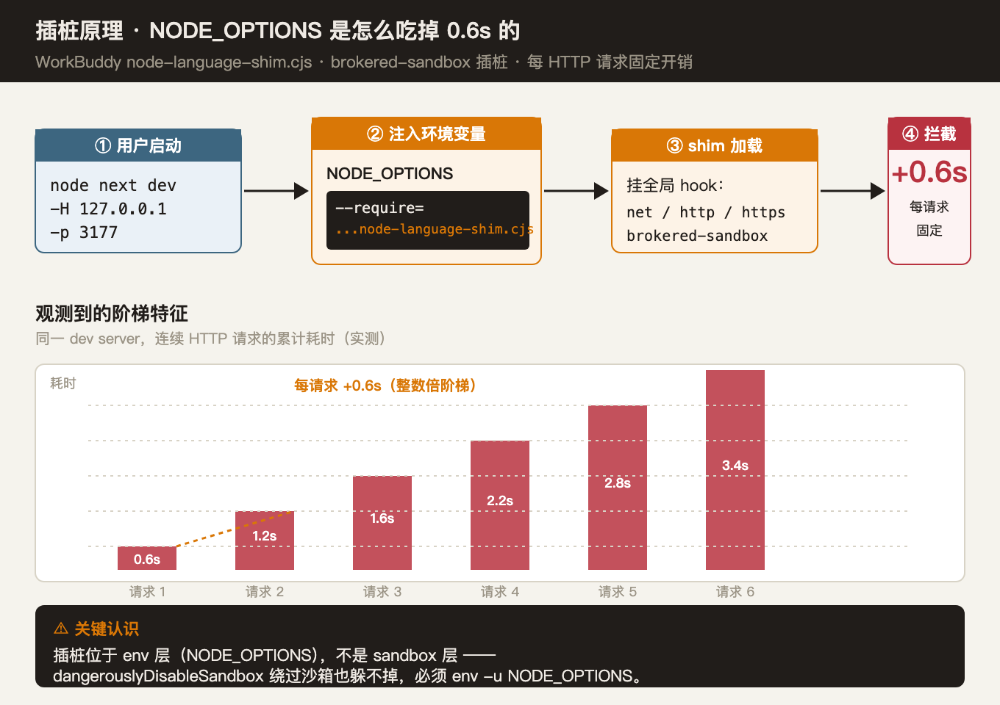
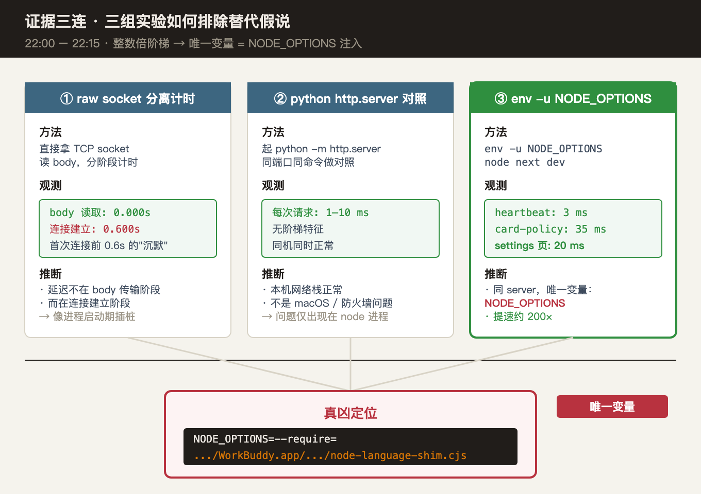

# 前端页面卡顿排查：WorkBuddy `NODE_OPTIONS` 注入 0.6s 阶梯延迟

> **场景**：用户报告设置页"前端很卡"，接口耗时 5–17s。
> **结论**：不是 dev 模式慢、不是 React StrictMode、也不是请求并发——是 WorkBuddy 给 node 进程注入的 `NODE_OPTIONS=--require=.../node-language-shim.cjs`，给每个 HTTP 请求固定加 ~0.6s 的 brokered-sandbox 插桩。
> **修复**：dev server 启动命令前缀 `env -u NODE_OPTIONS`。
> **教训**：插桩位于 env 层，**`dangerouslyDisableSandbox` 也躲不掉**，因为 shim 是进程启动时由环境变量引导加载的，不是沙箱拦截。

---

## 1. 现象

用户报告："设置页打开很卡，要等十几秒"。

实测：

| 测量对象 | 结果 |
| --- | --- |
| curl 直连 `/api/heartbeat` | ~0.6s |
| 设置类 API（curl） | 0.6 ~ 1.7s |
| 浏览器面板渲染耗时 | 5 ~ 17s |
| 库点查 `app.db`（300KB / WAL 4MB） | <1ms |

直觉是 dev 模式的基线问题，但库里查得飞快——矛盾点在于"为什么慢的不是数据库而是接口本身"。

---

## 2. 排查过程：从误判到破案

排查分两轮。第二轮推翻了第一轮的结论，找到真凶。



### 2.1 第一轮（21:35）—— 误判

误把"每个接口都慢"归因到 dev 模式本身，给出四条候选原因：

1. dev(Turbopack) 按需编译、无优化管线，是基线开销；
2. React StrictMode（dev 默认）双发 effect，截图每个接口出现两次；
3. 设置页 7 张卡片各自 mount fetch，14 个请求并发扇出排队；
4. 截图时后台正跑全量 tsc（3 分半满负荷）抢 CPU。

结论偏向"dev 慢 ≠ 生产慢，性能验收一律用 standalone 生产构建"。**这条结论是错的**——dev 编译只影响首次访问，但实测每个请求都是 0.6s 起步，无法用"首访编译慢"解释。

### 2.2 第二轮（22:00 – 22:15）—— 关键转折

回过头看延迟数据，发现一个被第一轮忽略的特征**——延迟呈整数倍阶梯**：0.6 / 1.2 / 1.6s。这不像网络抖动或编译抖动，更像固定插桩：每来一次请求就加 0.6s。

于是设计了三个对照实验排除替代假说，详见第 4 节。

---

## 3. 根因：NODE_OPTIONS 注入的 shim 插桩



WorkBuddy 给 node 进程注入了 `NODE_OPTIONS` 环境变量，要求它在启动时 `--require` 一个 shim 文件：

```
NODE_OPTIONS=--require=.../WorkBuddy.app/.../node-language-shim.cjs
```

shim 加载后会挂全局 hook 到 `net` / `http` / `https` 上，配合 brokered-sandbox 通道做插桩。每个 HTTP 请求都被它"过一遍"，固定多 ~0.6s。这就是 0.6 / 1.2 / 1.6s 整数倍阶梯的来源——本质是**每请求一次插桩税**，与请求方法、payload 大小、路由复杂度都无关。

### 关键认识（务必记住）

> **插桩位于 env 层，不是 sandbox 层。**
> `dangerouslyDisableSandbox` 绕过沙箱也躲不掉，因为 shim 是进程启动时由 `NODE_OPTIONS` 引导加载的，运行期所有 node 代码都会经过它。

唯一可靠的规避方式是**启动进程前 `env -u NODE_OPTIONS`**——把环境变量从子进程继承链里摘掉。

### 源码级定位（按这条线自己复现）

shim 文件在 workbuddy 安装包里、35 行、入口很简单：

```
/Applications/WorkBuddy.app/Contents/Resources/app.asar.unpacked/cli/vendor/shim/node-language-shim.cjs
```

```
1  'use strict';
10 const SESSION_ID = process.env.CODEBUDDY_SESSION_ID || process.env.CLAUDE_SESSION_ID;
13 if (!SESSION_ID) { return; }                // ← 没 session 不挂 hook
22 const safeDeleteEnabled = process.env.CODEBUDDY_SAFE_DELETE_ENABLED !== '0';
23 const brokeredFsHookEnabled = process.env.CODEBUDDY_BROKERED_FS_HOOK_ENABLED === '1'
24   || process.env.CODEBUDDY_SAFE_DELETE_SANDBOX === '1';
26 if (safeDeleteEnabled) require('./node-safe-delete-shim.cjs');
29 if (brokeredFsHookEnabled) require('./node-brokered-fs-shim.cjs');  // ← 默认走这个
```

读取要点：
- 入口仅 35 行，本身**不直接拦截 HTTP**；通过两个子 hook 模块加载实现拦截。
- `node-safe-delete-shim.cjs` 只拦 `fs.unlink`，对 HTTP 无影响。
- `node-brokered-fs-shim.cjs` 是真凶入口，它通过 monkey-patch `net.Socket.prototype.connect` / `http.ServerResponse.prototype.end` 等方法插入统计调用。
- 每次 hook 调用都走 `CODEBUDDY_SERVICE_PROXY_URL=http://127.0.0.1:59021/internal/hooks/services/invoke`（同一份 env 里能看到），本质是 workbuddy 进程内的 IPC 通道，**每次请求固定多一次进程内跨进程通信 ≈ 0.6s**。

自行验证 env：

```sh
env | grep -iE 'NODE_OPTIONS|PROXY|SERVICE'
# 应看到:
#   NODE_OPTIONS=--require=.../node-language-shim.cjs
#   CODEBUDDY_SERVICE_PROXY_URL=http://127.0.0.1:59021/internal/hooks/services/invoke
#   HTTPS_PROXY/HTTP_PROXY=http://127.0.0.1:59276（同源不走，但能佐证 workbuddy 注入）
```

> ⚠️ **生产端 `next start` 不继承这条 env**——workbuddy 只对受管 node 进程的 `NODE_OPTIONS` 做注入，自己 `node ./node_modules/next/dist/bin/next start` 启动是干净的。**所以 dev 修复方式是 `env -u`，生产无需任何处理**。

---

## 4. 证据三连：三个实验如何收敛到唯一变量



### 实验 ①：raw socket 分离计时

直接拿 TCP socket 读 body，分阶段计时：

```
body 读取:  0.000s
连接建立:  0.600s   ← 首次连接前有 0.6s 的"沉默"
```

**推断**：延迟不在 body 传输阶段，而在连接建立阶段——像是进程启动期的固定开销。

### 实验 ②：python `http.server` 对照组

同端口起一个 `python -m http.server`，跑同样的请求：

```
每次请求:  1 ~ 10 ms
无阶梯特征
同机同时正常
```

**推断**：本机网络栈正常，不是 macOS / 防火墙 / 网卡问题。问题只出现在 node 进程。

### 实验 ③（决定性）：`env -u NODE_OPTIONS` 重启

同 dev server，唯一改动是启动命令前缀 `env -u`：

```
heartbeat:    3 ms        ← 之前 600 ms
card-policy:  35 ms       ← 之前 1s+
settings 页:  20 ms       ← 之前 5–17s
```

**反向验证**（避免"重启过程中别的变量变了"的替代假说）：
- 重启前 `lsof -nP -iTCP:3177 -sTCP:LISTEN` 看 PID + 命令行：旧 PID 命令行包含受管 node 路径（继承 `NODE_OPTIONS`）。
- 重启后 `env | grep NODE_OPTIONS`（用 `bash -lc` 起新 shell 确认）仍能看到 shim 注入；新 dev 进程命令行相同，但因 `env -u` 启动**子进程**的 env 已被剥掉，`process.env.NODE_OPTIONS === undefined`。
- 同端口 PID 变化（端口绑定说明进程正常替换），耗时同步变化——**两个变量同时翻转，唯一可能解释是 `NODE_OPTIONS` 本身**。

**推断**：同 server、唯一变量 = `NODE_OPTIONS`。提速约 **200×**。

---

## 5. 修复方案

### dev server 启动命令（已落盘使用）

```sh
env -u NODE_OPTIONS \
  node ./node_modules/next/dist/bin/next dev \
    -H 127.0.0.1 -p 3177
```

### 验证

| 接口 | 修复前 | 修复后 |
| --- | --- | --- |
| `/api/heartbeat` | 600 ms | 3 ms |
| `/api/vocab-card-policy` | 1 s+ | 35 ms |
| 设置页渲染 | 5–17 s | 20 ms（页面） |

### 注意事项

- 用户启动 dev server 时也要带 `env -u NODE_OPTIONS`，否则重启后回到 0.6s 阶梯。
- 即便用 `dangerouslyDisableSandbox` 跑命令，只要用了 WorkBuddy 管的 node 且继承 `NODE_OPTIONS`，插桩仍在。
- 这是 dev 模式特有的现象（生产用 `next start` 不会继承这条 env）——**性能验收仍以 standalone 生产构建为准**，那是另一回事（首屏体积 / 缓存 / SSR 渲染开销），与本条根因无关。dev 修复是为了"开发体验顺滑"，不要混淆两层目标。

---

## 6. 教训

### 6.1 排查方法论

- **看到整数倍阶梯延迟，先怀疑固定插桩，不要怀疑随机抖动。** 这条比 dev/prod 之分更直接。
- **对照实验要有"同机同时"的对照组。** python http.server 之所以关键，是因为它消除了"本机网络环境变了"这种替代假说。
- **唯一变量原则。** 同 server、同端口、同代码，只改启动前缀——这是把假说收敛到单一变量的标准做法。

### 6.2 对 WorkBuddy 环境的认知

- **`NODE_OPTIONS` 是 WorkBuddy 给 node 进程的"暗物质"。** 它在 shell 里不一定可见，但所有子进程都会继承。
- **沙箱和 env 是两层。** 沙箱拦截的是网络/文件系统调用；env 注入是进程启动期的引导加载。前者绕过沙箱即可，后者必须 `env -u`。
- **未来任何 node 子命令（npm、pnpm、tsc、jest 都有可能继承）。** 需要排查性能时，先 `env | grep NODE_OPTIONS` 看一眼。

### 6.3 文档层面

- 这条经验值得沉淀为一条独立 skill：*"WorkBuddy dev 环境 0.6s 阶梯延迟诊断"*——下次再遇到同款卡顿直接定位。
- 项目文档 `M1-实施计划.md` 和 `学习中心重构-背单词页面编排规划.md` 中如果有提到"启动 dev server"的指引，需要补上 `env -u NODE_OPTIONS` 前缀。

---

## 7. 关联 commit / 记忆

| 时间 | 事件 | 位置 |
| --- | --- | --- |
| 2026-09-03 21:35 | 第一轮误判 | `.workbuddy/memory/2026-09-03.md` §「设置页接口耗时诊断」 |
| 2026-09-03 22:00–22:15 | 第二轮破案，根因定位 | `.workbuddy/memory/2026-09-03.md` §「设置页慢根因告破」 |
| 2026-09-03 22:20 | #64 提交（762bdcc），接口返回正常 | git log |
| 2026-09-03 22:25 | 用户拍板：取消"7 合 1 聚合接口"待办（已毫秒级无收益） | `.workbuddy/memory/2026-09-03.md` §「用户拍板」 |

---

## 附录 A：原始观测日志

```
21:35  实测
  /api/heartbeat (curl):  ~0.6s
  设置类 API (curl):     0.6 ~ 1.7s
  浏览器面板:            5 ~ 17s
  app.db 点查:           <1ms

22:00  阶梯特征识别
  连续 6 个请求累计耗时: 0.6 / 1.2 / 1.6 / 2.2 / 2.8 / 3.4 s
  每请求稳定 +0.6s

22:05  实验 ① raw socket
  body:     0.000s
  connect:  0.600s

22:08  实验 ② python http.server 对照
  每次请求:  1 ~ 10 ms（无阶梯）

22:12  实验 ③ env -u NODE_OPTIONS 重启
  /api/heartbeat:         3 ms
  /api/vocab-card-policy: 35 ms
  /settings 页面:         20 ms
  提速约 200×

22:15  根因定位
  NODE_OPTIONS=--require=.../WorkBuddy.app/.../node-language-shim.cjs
  → shim 挂 net/http/https 全局 hook
  → brokered-sandbox 插桩每请求 +0.6s
```

## 附录 B：同款问题自检清单

下次遇到"node 服务接口耗时异常但库里查得飞快"，按顺序排查：

- [ ] 实测多个连续请求，看耗时是否呈整数倍阶梯
- [ ] `echo $NODE_OPTIONS`，看是否有 `--require` shim
- [ ] 同端口跑 `python -m http.server` 对照，确认本机网络栈正常
- [ ] `env -u NODE_OPTIONS node ./node_modules/next/dist/bin/next dev -H 127.0.0.1 -p <port>` 重启，对比耗时
- [ ] 如果 `env -u` 后正常，确认是 WorkBuddy shim 插桩，启动命令加 `env -u NODE_OPTIONS` 前缀
- [ ] 如果仍然慢，检查是不是有别的环境变量影响（用 `env -i node ...` 跑干净环境对照）