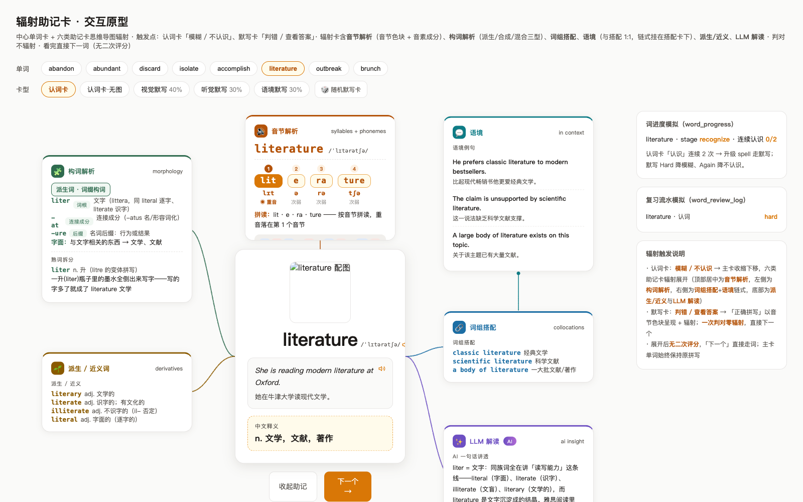

# 单词助记系统设计

> **背景**：现有认词卡只展示单词/音标/图/中文/例句，长单词即便有图仍觉得"生硬死记"。  
> **核心论断**：不是展示信息不够，而是缺少**「拆词可视化 + 主动求助驱动的助记支架」**。  
> **设计原则**：**JIT 学习**（Just-in-Time）—— 易词零干扰，难词倾囊相助。  
> **实现路径**：读音解析（v2.2 LLM 生成「音节+音素」双层落库）+ 构词解析（v2.3 LLM 生成 morph 三型：派生 derived / 合成 compound / 混合 blend）+ 派生·词性（LLM 生成 `derives` 含 `pos`）+ 真实语境（v2.4 词组搭配与例句合并卡）。  
>
> **v2 修订（2026-09-05）**：① 词组搭配升级为**所有卡片通用区块**（不再限定默写卡 Good 弹窗）；② 原"谐音联想"改为**LLM 解读**（具体形态未定，设计与实现均延期）；③ affix 词书不建独立表，词根作为**特殊 word 入 words 表**（kind 存 contentJson）；④ 删除助记区折叠设计与相关持久化。  
>
> **v2.1 修订（2026-09-06）**：⑤ 助记显示后**取消二次评分**——评分随求助动作一次确定，看完助记直接下一词；⑥ 默写卡**一次判对 ≡ 认识**（无助记直接下一词），求助分两级：**提示**（用后判对最多记 Hard）→ **查看答案**（Again + 揭示全部助记）。  
>
> **v2.2 修订（2026-09-06）**：⑦ 音节解析升级**「音节+音素」双层、完全 LLM 结构化生成**落库 `contentJson.syl`（推翻 v2.1「运行时切分不落库」）；⑧ 揭示态布局改为**径向思维导图**：主卡原样居中，五张助记卡辐射展开（§3 原型设计），废弃堆叠布局。  
>
> **v2.3 修订（2026-09-06）**：⑨ 词根词缀拆解升级为**「构词解析」morph 三型**（derived 派生 / compound 合成 / blend 混合）；⑩ **删除熟词拆分（trueWordSplit）整节**；⑪ **新增语境卡 context**（contexts 与 collocations 1:1，例句按词组生成，连线挂词组搭配卡不直连主卡）；⑫ `derives` **加词性 `pos`**；⑬ 导入时前五类**五次独立 LLM 调用**（morph / syl / derives / collocations 可并行，contexts 依赖 collocations 串行在后），prompt 默认内置、可在 `app_settings.mnemonic.prompts.*` 修改（§5 给五个 prompt 设计模板）；章节重排为 **2.1 音节 / 2.2 构词解析 / 2.3 派生·词性·近义 / 2.4 词组搭配 / 2.5 语境 / 2.6 LLM 解读**，原型由五卡升级为**六卡**（原五卡 + 语境卡）。
>
> **v2.4 修订（2026-09-06）**：⑭ **词组搭配与语境合并为「真实语境」单卡**——词组搭配与语境本质都是真实语境，例句天然承载词组，卡内直接展示例句 + 中文释义，**词组在句中显著高亮**，例句**带发音**（TTS）；⑮ **LLM 解读卡从设计中完全移除**（原 P2 延期项，`llmInsight` 字段与渲染分支一并删除）；⑯ **音节解析更名「读音解析」**（内容不变，语义更准——卡内含音素层，不只音节）；⑰ 原型收敛为**四卡**：左上 构词解析 / 左下 派生·近义 / 右上 读音解析 / 右下 真实语境，全部直连主卡（废除链式连线）；舞台扩为 1500×1000 无界画布（卡间零挤压零遮挡），辐射时**主卡完全不变**；⑱ 生成管线由五次调用改为**四次独立调用**（真实语境 = 词组 + 例句一次配对生成，消除 contexts 串行依赖）。
>
> **v2.5 修订（2026-09-06）**：⑲ **删除 collocations 独立字段**——真实语境只存 `contexts` 单字段，词组**内嵌到每条例句**（`coll` / `collZh?`），消除跨数组 1:1 配对与 collocationRef 间接引用；⑳ `contexts` 增加**例句音频 `audio`**，字段契约完全对齐 `examples[]`（百词斩例句 `{en, cn?, audio?}`）：TTS 落盘 `public/audio/contexts/{word}_{idx}.mp3` 后回写路径，`audio` 空 = 未生成或失败；㉑ 词组高亮匹配规则升级——支持词形屈折（isolate→isolates）与 `coll` 中 ` ... ` 通配（`isolate ... from` 命中 `isolates the virus from`），匹配不到兜底高亮 headword；㉒ §5 补充**四个 prompt 默认模板全文**（morph / syl / derives / context），并明确 prompt 后续在**设置界面**维护（`app_settings.mnemonic.prompts.*`，随 P1.6 落地）。

---

## 1. 触发机制：用户主动求助驱动


**核心交互契约**（v2.1）：

| 用户行为            | 评分    | 助记显示                                          |
| --------------- | ----- | --------------------------------------------- |
| 认词卡正面（揭示前）      | —     | 仅显示 **音节色块** + **音标**（属于"音形图"必要信息，非助记）        |
| 认词卡点 **认识** ✓   | Good  | 直接跳下一词，**无任何助记**（已记住不浪费认知带宽）                  |
| 认词卡点 **模糊** ~   | Hard  | 揭示中文/例句/图 + 立即辐射四张助记卡：**读音解析 / 构词解析 / 真实语境 / 派生·近义** |
| 认词卡点 **不认识** ✗  | Again | 同模糊路径，揭示 + **同样的助记区块**                        |
| 默写卡一次 **判对**    | Good  | ≡ 认识：直接跳下一词，**无助记**（拼对即掌握信号，与认词卡"认识"同逻辑）      |
| 默写卡点 **提示** 后判对 | Hard  | 揭示答案 + 助记区块（读音解析在内；用过提示，最多记 Hard）             |
| 默写卡点 **查看答案**   | Again | 揭示答案 + 助记区块（读音解析在内；彻底求助，记 Again）              |

**交互要点**：

- **一次评分**：求助即评分。认词卡三键、默写卡"判对/提示/查看答案"各档动作直接映射 FSRS 评分，助记展示不附加第二轮按钮——减少一次决策，复习节奏更快
- **默写卡两级求助**：「提示」给部分线索（如首字母/词根闪现），保留主动回忆；「查看答案」是放弃主动回忆的兜底。两级都揭示全部助记区块，但评分档位不同（Hard vs Again）

**为什么这样设计**：

- 用户点"认识"（认词卡）/ 拼对即判（默写卡）= 已掌握信号 → 系统信任记忆 → 不堆信息
- 用户点"不认识/模糊/提示/查看答案"= 主动求助信号 → 系统倾囊相助：各助记区块同框呈现（v2.4 起为四张辐射卡）
- 这把"评分"和"助记强度"做了**用户主动选择**的耦合，**比"按词长阈值给助记"更尊重用户**；且评分随求助一次确定，助记后不设二次评分，交互链路更短

理论依据：**Just-in-Time 学习**（JIT）—— 困难时即时获取支架（Scaffold），简单时不浪费认知带宽。

---

## 2. 助记机制详细设计

### 2.1 读音解析（v2.2：LLM 生成「音节+音素」双层，落库；v2.4 更名）

> 注（v2.4）：原「音节解析」更名**「读音解析」**——卡内承载音节色块 + 音素层 + 读音要点，「读音」比「音节」更准确地覆盖全部内容；数据结构与生成方式不变。

**双层职责**（数据契约，LLM 结构化输出，落 `contentJson.syl`）：

- **音节层**——管"读的节奏"：`parts[]` 字母分段 / `ipa[]` 每段读音 / `stress` 主重音下标 / `secondary[]` 次重音
- **音素层**——管"每个音怎么发"：`phonemes[]{p, syl, type, desc}`（type=vowel|consonant，desc=一句发音要领，允许留空）/ `combos[]{letters, sound, desc}`（字母组合→读音规律，如 ture→/tʃə/）/ `notes[]` 发音要点

**完整性约束**（导入时校验，不过则拒收该字段）：

- `phonemes.map(p => p.p).join("") === ipa.join("")`（音素拼合必须还原整词音标）
- `phonemes[].syl ∈ [0, parts.length)`（归属音节下标合法）
- `type ∈ {vowel, consonant}`

**渲染形态**（径向原型的「读音解析」卡，右上位，见 §3）：音节色块 + 重音标记在上；音素 chip 条居中（元音暖红 / 辅音靛蓝，按音节分组，`·` 分隔）；「音素细讲」抽屉默认收起，展开后为逐音素发音要领 + 字母组合 + 发音要点。

**缺数据兜底**：LLM 未生成或校验不过时，回退为运行时规则切分的纯字母色块（无音素层、无抽屉）——功能降级不阻断。

完整示例见**附录 A2**（literature：4 音节 / 8 音素 / 2 组合 / 2 要点）。

### 2.2 构词解析（v2.3：morph 三型，替代原词根词缀拆解）

> **v2.3 升级说明**：原「词根词缀拆解（affixBreakdown）」在 v2.3 升级为**「构词解析」morph**，统一覆盖派生 / 合成 / 混合三类构词；原**「熟词拆分（trueWordSplit）」整节在 v2.3 删除**（理由见 §8 v2.2→v2.3 变更表与取舍说明）。

**两层含义**：

- **A. 单词维度的辅助字段**：每个 word 的 `contentJson.morph`，揭示后呈现三类构词叙事之一（派生 `derived` / 合成 `compound` / 混合 `blend`），含字面义串接 `literal` 与逐片段 `pieces[]`
- **B. affix 特殊词**：高频词根词缀（~200 个）作为**特殊 word 直接入 words 表**（不建独立 affix_words 表），`contentJson.kind = "affix"` 标记类型，词根正文存 `word` 列（如 `un-`、`believ`、`-able`），富信息存 contentJson。用户可选 affix 词书加入背词计划**直接背词根本身**（如 `believ = 相信` + 例词列表 + 助记钩子）

**morph 结构**（v2.3 新字段，替代 affixBreakdown）：

```typescript
// words.contentJson，普通词 / 派生词：kind 缺省或 "word"
{
  morph: {
    type: "derived" | "compound" | "blend";  // 构词类型（LLM 判断）
    literal: string;        // 字面义串接，如 "un- 否定 + believ 相信 + -able 能…的"
    pieces: Array<{
      piece: string;        // 构词片段（含连字符规范拼写）
      kind: "prefix" | "root" | "suffix"   // derived 用
          | "word"                             // compound 用（来源真词）
          | "blend-head" | "blend-tail";       // blend 用（截头 / 截尾）
      meaningZh: string;    // 片段中文释义
      fromWord?: string;    // compound/blend 时指向来源真词（如 outbreak 的 out/break）
    }>;
  }
}
```

**三型判定（LLM 判断，不强求 compound/blend）**：

- **derived 派生**：能拆成「前缀 + 词根 + 后缀」形态学片段（believ/un-/able 这类）。`kind` 用 prefix/root/suffix，`fromWord` 缺省
- **compound 合成**：由两个完整真词拼合而成（outbreak = out + break、sunflower = sun + flower）。`kind` 用 `word`，`fromWord` 指向来源真词，仍是教学性拆解但明确是"两个真词合成"
- **blend 混合**：截搭混合（brunch = break**f**ast 截头 + l**unch** 截尾）。`kind` 用 `blend-head` / `blend-tail`，`fromWord` 指向被截取来源真词

> compound / blend **不强求**——明确是派生就给 `derived`；只有当词确由两个真词拼合、或确为截搭混合时，LLM 才给 `compound` / `blend`。

**为什么不建独立表**（affix 特殊词）：word_progress / 选词 API / FSRS 调度 / 复习链路全部以 `words.id` 为主键挂载，独立表意味着整条学习链路要为 affix 再做一遍。affix 以特殊词身份入 words 表后，**调度、进度、复习零改动全链路复用**。

**唯一性约定**：words 表 `unique(word)` 全局唯一，affix 词用**带连字符的规范拼写**（`un-` / `-able`）与真词天然区分；无连字符词根（如 `believ`、`photo`）与真词撞名时，导入脚本检测 `unique(word)` 冲突并跳过 + 日志告警（撞名词根极少，人工改名缀形式即可，如 `believ-`）。`contentJson.kind` 是类型判定的**唯一权威依据**，前端不靠拼写猜。

**affix 特殊词的 contentJson 结构**（原样保留）：

```typescript
// words.contentJson，kind = "affix" 时
{
  kind: "affix",            // 类型标记（唯一权威判定）
  meaning: string;          // 词根英文释义
  meaningZh: string;        // 词根中文释义
  examples: string[];       // 词根出现的常见单词
  derivatives: string[];    // 派生的同根词
  mnemonic: string;         // 词根本身的助记
  collocations?: string[];  // 高频搭配（可选）
}
```

**数据源**：**LLM 批生成**（与生图/TTS 同构的异步管线，导入词库时一次性生成；v2.4 起 morph 为四次独立 LLM 调用之一，见 §5）。

**LLM prompt 输出格式**（JSON Schema，对应 §5 prompt ①）：

```json
{
  "morph": {
    "type": "derived",
    "literal": "un- 否定 + believ 相信 + -able 能…的",
    "pieces": [
      {"piece": "un-",    "kind": "prefix", "meaningZh": "否定"},
      {"piece": "believ", "kind": "root",   "meaningZh": "相信"},
      {"piece": "-able",  "kind": "suffix", "meaningZh": "能…的"}
    ]
  }
}
```

> 注（v2.1 已废除）：~~音节切分运行时算，LLM 不重复输出 syllables~~ → v2.2 起读音解析由 LLM 独立调用产出（见 §2.1、附录 A2）；v2.3 起 morph 亦为独立调用，与原 affixBreakdown 同一次调用产出时代不同。

**示例**（believ 词根，affix 特殊词）：

| word   | kind  | meaning | examples                                  | derivatives          |
| ------ | ----- | ------- | ----------------------------------------- | -------------------- |
| believ | affix | 相信      | believe, belief, unbelievable, disbelieve | believable, believer |
| un-    | affix | 不       | unable, unhappy, unfair, uncertain        | —                    |
| -able  | affix | 能…的     | readable, comfortable, reliable           | —                    |

### 2.3 派生·词性·近义（LLM 生成 derives，含 pos）

**定位**：与构词解析（morph）互补的**同族派生展示位**——morph 讲"这个词怎么由片段拼成"，本卡讲"这个词还衍生出哪些同族词、各自什么词性"，帮助用户在词族网络里一次记住一片。

**数据结构**（v2.3 新字段 `derives`，相比原型占位新增 `pos` 词性）：

```typescript
words.contentJson.derives: Array<{
  word: string;       // 同族派生词
  pos: string;        // 词性（标准缩写：n. / v. / adj. / adv. / phr. ...）
  meaningZh: string;  // 中文释义
}>
```

**生成要点**（对应 §5 prompt ③）：

- `pos` 用标准缩写，覆盖 n./v./adj./adv.；原型新增卡位，与 morph 可由 LLM 同批次（但分调用）产出
- 优先列高频、与当前词形近义清晰的派生（如 believe → belief n. / believable adj. / disbelieve v.）
- 近义可并入同一数组以 `kind` 区分（可选扩展），v2.3 默认仅 `derives`，近义后续扩展

**显示位**：径向原型「左下 🌱 派生/近义」卡（见 §3 四卡表）。

### 2.4 真实语境（v2.4 词组+语境合并卡；v2.5 单字段自含词组 + 例句音频）

> **v2.5 修订**：在 v2.4 合并基础上进一步收敛——**collocations 独立字段删除**，词组内嵌到每条例句（`coll`），不再需要 collocationRef 跨数组配对；`contexts` 增加**例句音频 `audio`**，字段契约完全对齐 `examples[]`（百词斩例句 `{en, cn?, audio?}`）。
>
> **v2.4 合并说明**：原「词组搭配」与「语境」本质都是真实语境：词组讲"这个词实际怎么用"，例句讲"这个用法在真句里长什么样"，例句天然承载词组，拆成两张卡是人为割裂。合并后卡内**以例句为主体**：直接展示例句 + 中文释义，**词组在句中显著高亮**，每条例句**带发音**（音频文件优先，TTS 兜底）。

**定位**：把高频搭配放进**自然例句**，词组与例句同条共生——用户读一句真句、顺带记住一个搭配，而不是先背孤立的词组再看例句。

**数据结构**（v2.5 起单字段，词组内嵌，对齐 `examples[]` 契约）：

```typescript
// 与 examples[]（百词斩例句 WordExample = {en, cn?, audio?}）同构：
//   en/cn   句子本体与中文翻译（cn 可空，同 examples）
//   audio   例句音频路径（TTS 落盘后回写；空/缺省 = 未生成或失败，同 examples[].audio）
words.contentJson.contexts: Array<{
  coll: string;    // 该例句承载的词组英文（句中高亮锚点，必须自然嵌入 en）
  collZh?: string; // 词组中文（可空，预留展示位）
  en: string;      // 例句英文
  cn?: string;     // 例句中文
  audio?: string;  // 例句音频路径 /audio/contexts/{word}_{idx}.mp3（TTS 异步回写）
}>
```

**音频关联方式（对齐 examples[].audio 的既有机制）**：

- 单词例句：`contentJson.examples[i] = { en, cn?, audio: "/audio/sentences/{word}_{i}.mp3" }`
- 语境例句：`contentJson.contexts[i] = { coll, en, cn?, audio: "/audio/contexts/{word}_{i}.mp3" }`
- 同构复用 TTS 管线：edge-tts 例句音色（en-US-EmmaMultilingualNeural，--rate=-8%）合成落 `public/audio/contexts/`，**文件就绪（>1KB，防 0 字节残留）才回写路径**；失败留空不阻塞。目录与 examples 的 `sentences/` 分开，文件名互不冲突
- 前端播放：`audio` 有值 → 播音频文件；空值 → speechSynthesis 运行时兜底（或按实现禁用按钮）

**渲染规则**（真实语境卡，右下位）：

- 按 `contexts` 渲染，每条 = 例句（`coll` 高亮 `<mark>`）+ 中文释义 + 🔊 发音按钮
- 词组高亮：按本条 `coll` 在 `en` 中定位（大小写不敏感）；匹配规则支持**词形屈折**（isolate→isolates）与 `coll` 中的 ` ... ` 通配（`isolate ... from` 命中 `isolates the virus from`）；仍匹配不到时**兜底高亮 headword**（含屈折 `word\w*`，同语境默写卡命中规则）
- 单字段自含：词组、例句、释义、音频全部在 `contexts[i]` 一条内，无跨数组引用
- 缺数据兜底：`contexts` 缺失 → 该卡不渲染；`audio` 空 → 发音按钮走 TTS 兜底

**生成方式**（对应 §5 prompt ④）：单次 LLM 调用直接输出 2-3 条 `{coll, collZh?, en, cn}`——词组与例句同条给出，天然配对，**无需 1:1 数量校验**（v2.4 的 `contexts.length === collocations.length` 与 collocationRef 精确匹配校验取消，改为「每条 coll 必须出现在 en 中」）；音频不在 LLM 调用中生成，由 TTS 管线异步落盘回写（同生图/TTS 既有异步模式）。

**显示位**：径向原型「右下 💬 真实语境」卡（见 §3 四卡表）。

### 2.5 LLM 解读（v2.4 已从设计中移除）

> 注（v2.4 删除）：原 §2.6「LLM 解读（llmInsight，P2 延期）」**从设计中完全移除**——四卡已覆盖难词的结构性需求（读音 / 构词 / 同族 / 语境），自由解读无结构规律可校验、形态不定，易成"LLM 硬塞的噪音"；原型已删除对应卡片、渲染分支与 `llmInsight` 字段。v2.3 的延期论证见 §8 v2.3→v2.4 变更表。

---

## 3. 原型设计（径向思维导图 · 四卡）

**交互形态**：求助揭示后，助记信息不再堆进主卡——**主卡保持认词卡原有样式与元素、尺寸位置完全不变**（图 / 单词 / 音节色块 / 音标 / 例句 / 中文释义 / 评分按钮），**四张**助记卡以思维导图方式从主卡辐射展开：SVG 贝塞尔连线从主卡边缘生长到各卡，落位带 stagger 弹簧动画（卡片起飞前完全透明，不在主卡上停留显形），hover 助记卡时对应连线加粗高亮，收起时连线回缩、卡片缩回主卡。信息密度由辐射卡分摊。

**无界画布**（v2.4）：舞台 1500×1000 固定坐标系，整体等比缩放适配容器宽度——空间给足，**卡间零挤压、零遮挡、零越界**；主卡正下方不放任何卡。

**触发点**（与 §1 契约一致）：认词卡点「模糊 / 不认识」、默写卡点「提示 / 查看答案」后自动辐射展开；「认识 / 一次判对」不辐射。

**主卡态**（abandon，揭示前——原认词卡样式不变）：


**辐射态**（literature，求助后四卡 + 连线展开）：



**助记卡四种**（辐射位固定；词缺某字段时对应卡不出、连线不渲染）：

| # | 辐射位 | 卡 | 内容 | 数据字段 |
| --- | --- | --- | --- | --- |
| 1 | 左上 | 🧩 **构词解析** | 派生 / 合成 / 混合三型逐段释义 + 字面义（derived 用前缀/词根/后缀；compound/blend 用来源真词锚点） | `contentJson.morph`（§2.2、附录 C） |
| 2 | 左下 | 🌱 **派生 / 近义** | 同族派生词 + 词性（pos）+ 中文释义 | `contentJson.derives`（§2.3） |
| 3 | 右上 | 🔊 **读音解析** | 音节色块 + 重音标记 + 音素 chip 条（元音暖红 / 辅音靛蓝，按音节分组）+「音素细讲」抽屉（逐音素发音要领 / 字母组合 / 发音要点） | `contentJson.syl`（附录 A2） |
| 4 | 右下 | 💬 **真实语境** | 2-3 条例句，**词组在句中显著高亮** + 中文释义 + 每句 🔊 发音（contexts 单字段自含词组 + 例句音频，§2.4） | `contentJson.contexts` |

**与 §2 机制的对应**：四类机制归并为四张辐射卡——构词解析独立成卡（morph 三型），派生/近义为展示增强位，读音解析管"怎么读"，真实语境管"怎么用"（词组+例句一体）。

**实现细节**（正式开发以 `prototype/vocab/card-demo/` 为直接参考）：

- 舞台 1500×1000，辐射卡固定宽 300，四卡目标位见 `radial.js` 的 `MN_POS`（左列 morph/derive、右列 syl/context，均直连主卡）；超高内容卡体 `max-height` + 内部滚动兜底
- 连线为 SVG 贝塞尔 path，全部从**主卡边缘**长出、锚在**卡片朝向主卡的内侧缘**（左列卡右缘 / 右列卡左缘），线不穿卡；`drawn` 类触发 stroke-dashoffset 生长动画；缺字段的卡与对应连线不渲染（`mnHasContent` 判定）
- 主卡在辐射前后**几何完全不变**（`radiateMn` 不再修改主卡任何样式）；起飞前卡片强制透明（`opacity:0`），落位时交还，避免在主卡上显形
- 「音素细讲」抽屉是**卡内信息分层**而非交互折叠——默认收起只为控制默认信息密度
- 真实语境卡例句发音复用 speechSynthesis（正式实现走 TTS 管线预生成音频，`public/` 落文件，与单词/例句 TTS 同构）
- 原型为纯前端模拟（静态数据 + WebAudio 音效），数据契约以 §2 / §4 为准；旧版「堆叠布局 + 空间核算」设计已废弃

---

## 4. 数据模型


### 4.1 迁移 0004

```sql
-- 1. affix 词根作为特殊 word 入 words 表(不建独立表)
--    复用现有 words 表结构, 无 DDL; 差异全部在 contentJson 内:
--    contentJson.kind = "affix"  ← 类型唯一权威标记
--    word 列存词根规范拼写(带连字符: "un-" / "-able"; 无连字符词根
--    与真词撞名时导入脚本检测 unique(word) 冲突并跳过+告警)

-- 2. word_books 加 bookType 列(标记词书用途, 供词书中心筛选展示)
ALTER TABLE word_books ADD COLUMN bookType TEXT NOT NULL DEFAULT 'word';
-- 'word' = 普通单词词书(默认); 'affix' = 词根词缀词书(成员是 affix 特殊词)

-- 3. words.contentJson 扩字段(无需 schema 变更, JSON 列直接加)
--   syl:        {parts, ipa, stress, secondary?, phonemes, combos?, notes?}  (v2.2 音节+音素)
--   morph:      {type, literal, pieces:[{piece, kind, meaningZh, fromWord?}]} (v2.3 构词解析, 替代 affixBreakdown)
--   derives:    Array<{word, pos, meaningZh}>                                (v2.3 派生·词性·近义)
--   contexts:   Array<{coll, collZh?, en, cn?, audio?}>                      (v2.5 真实语境·单字段: 词组内嵌+例句音频, 契约对齐 examples[].audio)
--   (v2.5 删除: collocations — 词组内嵌进 contexts[].coll, 不再独立存储)
--   (v2.4 删除: llmInsight)
--   (v2.3 删除: trueWordSplit)
```

### 4.2 字段语义说明

| 字段                 | 用途          | 写入时机                | 缺字段处理      |
| ------------------ | ----------- | ------------------- | ---------- |
| `syl`              | 读音解析·音节+音素（v2.2） | **LLM 批生成（独立调用），落库**（导入校验拼接约束） | 运行时规则兜底：仅字母色块，无音素层 |
| `morph`            | 构词解析（v2.3，三型） | **LLM 批生成（独立调用）**     | 缺 → 隐藏构词卡 |
| `derives`          | 派生·词性·近义（v2.3） | LLM 批生成（独立调用）        | 缺 → 隐藏派生卡 |
| `contexts`         | 真实语境（v2.5：词组内嵌 `coll` + 例句音频 `audio`，对齐 `examples[].audio`） | LLM 批生成（真实语境调用）+ TTS 回写 audio | 缺 → 真实语境卡不渲染（audio 空 → TTS 兜底播放） |
| `contentJson.kind` | affix 特殊词标记 | 导入词根时写入             | 普通词无此字段    |

### 4.3 contentJson 字段存储说明

**答**：是的，contentJson **完整存储**拆分后的 piece 和释义，不只是索引/外键。原因：

- **渲染零依赖**：前端不需要再去 ECDICT 查 piece 是否真词、不需要再调 LLM 问释义，所有渲染数据一次性到位
- **审计可追溯**：用户对某词的助记有疑问时，看 contentJson 就能知道 piece 和释义从哪里来（LLM 生成时连 piece + 释义一起出）
- **避免 N+1 查询**：认词卡的渲染在客户端，一次取出 contentJson 即可，无需异步查词库

具体字段结构：

```typescript
// 构词解析(完整存储片段 + 释义 + 来源真词, v2.3 替代 affixBreakdown)
words.contentJson.morph: {
  type: "derived",
  literal: "un- 否定 + believ 相信 + -able 能…的",
  pieces: [
    { piece: "un-",    kind: "prefix", meaningZh: "否定" },
    { piece: "believ", kind: "root",   meaningZh: "相信" },
    { piece: "-able",  kind: "suffix", meaningZh: "能…的" }
  ]
}

// 派生·词性·近义(完整存储派生词 + 词性 + 释义, v2.3)
words.contentJson.derives: [
  { word: "belief",       pos: "n.",   meaningZh: "相信；信念" },
  { word: "believable",   pos: "adj.", meaningZh: "可信的" },
  { word: "disbelieve",   pos: "v.",   meaningZh: "不相信" }
]

// 真实语境(单字段, 词组内嵌 + 例句音频, v2.5 对齐 examples[] 契约)
words.contentJson.contexts: [
  { coll: "hard to believe",      collZh: "很难相信",
    en: "It is hard to believe he finished it overnight.", cn: "很难相信他一夜之间就做完了。",
    audio: "/audio/contexts/unbelievable_0.mp3" },
  { coll: "find it unbelievable", collZh: "觉得难以置信",
    en: "I find it unbelievable that she passed the exam.", cn: "我觉得她通过考试难以置信。",
    audio: "/audio/contexts/unbelievable_1.mp3" }
]
```

**释义生成时机**：morph / derives / contexts 各自由 LLM **一次性**给出片段 + 释义（+ 来源真词 / 词性 / 词组例句配对），**不二次查询**（避免 N+1 + 成本叠加）；`contexts[].audio` 由 TTS 管线**异步落盘后回写**（与 `examples[].audio` 同机制，>1KB 才写）。v2.5 起这些字段的生成是**四次独立 LLM 调用中的三路**（见 §5），ECDICT 不再参与（熟词拆分已在 v2.3 删除）。

---

## 5. LLM 异步生成管线（四次独立调用 + 可配置 prompt）


**与生图/TTS 同构**，复用 import pipeline：

```
1. 词库导入触发 → ② 任务队列逐词 → ③ LLM 生成（v2.4 起每词 4 次独立调用，全部可并行）
       ┌─ ① morph    (构词解析)          ┐
       ├─ ② syl      (读音解析)          ├─ 无相互依赖，可并行
       ├─ ③ derives  (派生·词性·近义)     │
       └─ ④ context  (真实语境: 词组+例句同条一体) ┘
                                                        ↓
                              ⑤ 词书详情页进度条展示 ←──── ⑥ 缺字段降级
```

> 注（v2.4）：原 ⑤ contexts 依赖 ④ collocations 的串行调用取消——词组与例句**一次配对生成**，四路调用全部并行。注（v2.5）：collocations 字段删除，prompt ④ 直接输出**自含词组的 contexts[]**（每条 `{coll, collZh?, en, cn}`），1:1 跨数组校验取消；例句音频由 TTS 管线落 `public/audio/contexts/` 后回写 `contexts[].audio`（对齐 examples[].audio 机制）。

**复用现有机制**：

- `tasks` 表（status / 进度 / 取消）—— 与生图任务同表，taskType=mnemonic
- 限速（默认 2 并发，可在 `app_settings.mnemonic.concurrency` 调）
- 失败重试 2 次（指数退避）→ 失败标缺字段
- DELETE 接口（取消任务）
- `importing[]` 幽灵卡防护（任务取消后不渲染）

**新增配置项**（`app_settings`）：

```typescript
mnemonic.enabled: boolean          // 总开关(默认 true, 生图失败/慢时可关)
mnemonic.concurrency: number       // 并发(默认 2)
mnemonic.retries: number           // 重试(默认 2)
mnemonic.prompts: {                // 四个 prompt 模板(默认内置, 全文见下; 设置界面维护, 随 P1.6 落地)
  morph: string;        // ① 构词解析 prompt
  syl: string;          // ② 读音解析 prompt
  derives: string;      // ③ 派生·词性·近义 prompt
  context: string;      // ④ 真实语境 prompt（词组+例句同条一体生成）
}
```

**四个 prompt 默认模板**（随代码内置发布，运行时落 `app_settings.mnemonic.prompts.*` 后**在设置界面维护**，见下文「Prompt 设置维护」；`{{word}}` / `{{ipa}}` / `{{meaningZh}}` / `{{pos}}` 为运行时变量占位）：

**通用约束（四个 prompt 共享）**：

- 只输出一个 JSON 对象——不要 markdown 围栏、不要解释文字
- 字段名与嵌套结构严格按模板，不得增删字段；中文一律简体
- 单路校验不过即整体拒收该字段（计入重试），失败隔离不影响其他三路调用

**① morph（构词解析）** — 输入 `{{word}}` + `{{ipa}}` + `{{meaningZh}}`

```text
你是英语构词分析专家。分析单词 {{word}}（音标 {{ipa}}，释义：{{meaningZh}}）的构词方式，只输出 JSON：
{
  "morph": {
    "type": "derived",          // derived 派生 | compound 合成 | blend 截搭混合
    "literal": "un- 否定 + believ 相信 + -able 能…的",   // 字面义中文串接
    "pieces": [
      { "piece": "un-", "kind": "prefix", "meaningZh": "否定" }
      // derived: kind ∈ prefix|root|suffix，不填 fromWord
      // compound: kind 一律 "word"，每个 piece 填 fromWord=来源真词（outbreak = out + break）
      // blend: kind ∈ blend-head|blend-tail，fromWord=被截取真词（brunch = breakfast 截头 + lunch 截尾）
    ]
  }
}
规则：不强求 compound/blend——明确是派生就给 derived；pieces 依序拼合必须覆盖整词拼写（前/后缀含连字符）。
```

**② syl（读音解析）** — 输入 `{{word}}` + `{{ipa}}`

```text
你是英语发音教学专家。为单词 {{word}}（音标 {{ipa}}）生成「音节+音素」双层读音解析，只输出 JSON：
{
  "syl": {
    "parts": ["lit", "e", "ra", "ture"],   // 字母分段
    "ipa": ["lɪt", "ə", "rə", "tʃə"],      // 每段读音，依序拼合 = {{ipa}}
    "stress": 0,                            // 主重音音节下标
    "secondary": [],                        // 次重音下标数组
    "phonemes": [
      { "p": "l", "syl": 0, "type": "consonant", "desc": "边音：舌尖抵上齿龈，气流从舌两侧通过" }
      // p=音素（依序拼合必须 === ipa 拼合）；type ∈ vowel|consonant；syl=归属音节下标
      // desc=一句发音要领；重复音素（如多次 schwa）desc 允许 ""
    ],
    "combos": [ { "letters": "ture", "sound": "/tʃə/", "desc": "字母组合读音规律，如 ture→/tʃə/ 同 nature/future" } ],  // 可省略
    "notes": [ "发音要点，1-3 条，如重音清晰其余含糊" ]   // 可省略
  }
}
硬约束（校验不过整体拒收）：phonemes 拼合 === ipa 拼合；syl 下标 ∈ [0, parts.length)；type 枚举合法。
```

**③ derives（派生·词性·近义）** — 输入 `{{word}}` + `{{meaningZh}}`

```text
你是英语词汇教学专家。列出单词 {{word}}（释义：{{meaningZh}}）的同族派生词（可含近义词），只输出 JSON：
{
  "derives": [
    { "word": "belief", "pos": "n.", "meaningZh": "相信；信念" }
  ]
}
规则：
- 2-5 条，优先高频、与 {{word}} 形近/同根清晰的派生（如 believe → belief / believable / disbelieve）
- pos 用标准缩写（n. / v. / adj. / adv. / phr.）；meaningZh 简洁
- 覆盖常见派生即可不穷举；确无合适派生时输出 "derives": []
```

**④ context（真实语境：词组 + 例句同条一体）** — 输入 `{{word}}` + `{{meaningZh}}`（+ 可选 `{{pos}}`）

```text
你是英语搭配与例句写作专家。为单词 {{word}}（释义：{{meaningZh}}）生成真实语境例句，只输出 JSON：
{
  "contexts": [
    { "coll": "hard to believe", "collZh": "很难相信",
      "en": "It is hard to believe he finished it overnight.",
      "cn": "很难相信他一夜之间就做完了。" }
  ]
}
规则：
- 2-3 条；coll 为真实高频搭配（学术/日常场景优先），en（8-20 词）须自然嵌入该 coll，不得只出现 headword
- en 中须出现 {{word}}（允许屈折变体，如 accomplish→accomplished）；各条 coll 不重复；cn 自然通顺
注：例句音频由 TTS 管线另行合成回写 audio（见 §2.4），本调用不生成。
```

**输出校验**（导入时逐路执行，不过则拒收该字段并计入重试）：

| prompt | 校验 |
| --- | --- |
| ① morph | `type ∈ {derived, compound, blend}`；compound/blend 的 piece 必须带 `fromWord`；pieces 拼合覆盖整词 |
| ② syl | `phonemes` 拼合 `=== ipa.join("")`；`syl` 下标合法；`type ∈ {vowel, consonant}` |
| ③ derives | 每条 `{word, pos, meaningZh}` 齐全；`pos` 为标准缩写 |
| ④ context | 每条 `coll` 非空且（大小写不敏感 + 允许屈折）能定位到 `en` 中 |

**Prompt 设置维护（界面）**：四个 prompt 的修改入口在**设置页**——落 `app_settings.mnemonic.prompts.{morph,syl,derives,context}`，界面为每个 prompt 提供多行文本编辑框（显示当前模板全文 + 变量占位说明）+ 「恢复默认」按钮（回填内置模板）。保存后仅对**后续**生成任务生效，已生成字段不变；需在词书详情页重跑该类生成才会按新 prompt 更新（与单路失败重跑机制一致）。该设置界面随 P1.6 落地。

**affix 词根入库**：词根书导入走同一管线——逐词根 LLM 生成 meaning/examples/derivatives/mnemonic，以特殊 word 写入 words 表（`contentJson.kind="affix"`）+ 建与 affix 词书的 book_word_relation（不含 morph/contexts，affix 特殊词仅用自身 contentJson）。

**进度可视化**：词书详情页顶部进度条 `X / 567` + 「补全助记」按钮 + 完成后弹「已完成」。

---

## 6. 实现优先级

| 阶段       | 内容                                                            | 数据依赖                | 工作量                      |
| -------- | ------------------------------------------------------------- | ------------------- | ------------------------ |
| **P1.1** | 读音解析：syl 字段（LLM 独立调用生成落库）+ 拼接校验 + 辐射卡渲染                  | LLM 批生成 + 字段扩       | 字段扩 + 校验 + 辐射卡渲染        |
| **P1.2** | 构词解析：morph 字段（derived/compound/blend 三型）+ 揭示后渲染 + affix 特殊词导入 | LLM 独立调用 + 字段扩 + 迁移 0004 | 字段扩 + UI 区块 + LLM prompt ① |
| **P1.3** | affix 特殊词导入（入 words 表 + kind 标记 + bookType=affix 词书 + 词书详情适配） | 迁移 0004 + 导入脚本      | 导入脚本 + UI 类型适配（调度链零改动）   |
| **P1.4** | 派生·词性·近义：derives 字段（含 pos）+ 揭示后渲染                       | LLM 独立调用 + 字段扩      | 字段扩 + UI 区块 + LLM prompt ③ |
| **P1.5** | 真实语境：context prompt 一次生成 contexts（单字段自含词组 `coll`）+ 词组句中高亮渲染（屈折 + ` ... ` 通配匹配）+ 例句音频（TTS 落 `/audio/contexts/` 回写 `audio`，对齐 examples[].audio） | LLM 独立调用 + 字段扩      | 字段扩 + 渲染 + TTS           |
| **P1.6** | 「补全助记」按钮 + 进度可视化 + 配置项 + **Prompt 设置界面**（设置页维护 prompts.* 四个模板：编辑框 + 变量说明 + 恢复默认） | app_settings 扩字段    | UI + 管线                  |

> v2.3 已删除原 P1.4 熟词拆分（trueWordSplit）实现项；v2.4 已删除原 P2 LLM 解读（llmInsight）实现项，原 P1.5/P1.6（词组搭配 + 语境两次调用）合并为 P1.5 真实语境。

---

## 7. 验证方法

### 7.1 数据层验证

```bash
sqlite3 data/app.db "SELECT word, content_json FROM words WHERE word IN ('unbelievable','breakfast','ambulance')" | jq
# 检查:
#   - morph.type ∈ {derived, compound, blend}; pieces 含 piece/kind/meaningZh（compound/blend 带 fromWord）
#   - derives 每条含 word/pos/meaningZh（pos 为标准缩写）
#   - contexts 每条含 coll/en/cn（coll 非空且能定位到 en 中），audio 回写后指向存在的 mp3
#   - 无 collocations 独立字段（v2.5 已删除）、无 llmInsight（v2.4 已删除）
sqlite3 data/app.db "SELECT word, content_json FROM words WHERE json_extract(content_json,'$.kind')='affix' LIMIT 5" | jq
# 检查: affix 特殊词 kind 标记 / meaning / examples / derivatives 齐全
```

### 7.2 UI 验证（agent-browser）

```
1. 打开 /learn → 选任意长词(单词背词流程)
2. agent-browser eval 点击 .rate-btn[data-rating="again"] (不认识)
3. eval 检查 .mn-card[data-mn="syl"|"morph"|"derive"|"context"] 四张辐射卡 DOM 存在性 + 连线 .wire 渲染（四条、全部直连主卡）
4. eval 确认真实语境卡内 .ctx-coll 高亮数 === contexts 数、.ctx-play 发音按钮逐句存在（audio 有值播文件、空值 TTS 兜底）
5. eval 确认揭示态无二次评分按钮([再认]/[还模糊] 不存在), 看完可直达下一词
6. 默写卡: 一次判对 → 断言直接跳下一词且无辐射; 点提示/查看答案 → 断言辐射卡存在
7. 截图前/后两个态对比 (主卡态 / 辐射态, 参考 §3 原型截图); 断言辐射前后主卡矩形零变化
8. 验证「补全助记」按钮 + 进度条:
   - 点 → 任务队列出现(每词 4 次 LLM 调用: morph/syl/derives/context 全并行)
   - 后端日志看 LLM 调用次数(应为词数×4)与成功率
   - 完成后 contentJson 字段被填充
9. 设置中修改某类 prompt → 重跑该类生成 → 字段按新 prompt 更新
```

### 7.3 边界用例

- 单词极短（cat、run）：无 morph、无 derives、无搭配/语境，但有 syl（单段，无音素细分也合法——单音节词 phonemes 可整段给 desc）
- 单词极长（uncharacteristically）：syl 多段（5-6 段），morph 三段（pre+root+suffix，type=derived）
- 合成词（outbreak）：morph.type=compound，pieces 两词均 `kind:"word"` 且带 `fromWord`
- 混合词（brunch）：morph.type=blend，pieces 为 `blend-head`+`blend-tail` 且带 `fromWord`（见附录 C）
- syl 拼接校验不过（LLM 漏音素/多音素）：该字段拒收落空 → 运行时规则兜底仅字母色块，并计入重试
- 真实语境校验：某条 `coll` 空、或（大小写不敏感 + 屈折 + ` ... ` 通配）都定位不到 `en` → 该字段拒收并计入重试
- TTS 失败 → `contexts[].audio` 留空，真实语境卡照常渲染（发音按钮走 speechSynthesis 兜底），不计入 LLM 重试
- context 调用失败 → 真实语境卡不渲染（其余三卡不受影响）
- LLM 全失败：词书详情页状态显示「补全失败 N 个」，用户可单条重试
- affix 词根与真词撞名（believ）：导入脚本检测 unique(word) 冲突跳过 + 告警日志

---

## 8. 关键设计取舍

**取舍 1：为什么不直接在 ECDICT 加字段？**

ECDICT 是**通用词典**，不含词根词缀（"believ=相信" 这种派生分析是教学/形态学产物，非词典本身职责）。所以 ECDICT 可作「真词字典」兜底，但**构词解析必须靠 LLM 生成**（v2.3 起 morph 替代原 affixBreakdown）。

**取舍 2：为什么音节解析改为 LLM 生成落库（v2.2 推翻 v2.1）？**

v2.1 方案是运行时规则切分、不落库。v2.2 推翻它，三个理由：

- **音素层规则算不出来**：音素级拆分（含 /tʃ/ 这类组合音素）、发音要领描述、字母组合规律，都不是 100 行规则函数能覆盖的——必须 LLM
- **同一次调用的一致性**：v2.2 时代 syl 与 morph/derives/collocations 在同一次 LLM 调用产出；v2.3 起改为独立调用（v2.4 定为四次，见 §5），各自职责更清晰、可独立重试与配置 prompt
- **渲染零依赖原则**：与 §4.3 同理，contentJson 一次性带齐所有渲染数据，前端不做二次推导

代价与兜底：每词多存约 300-500B JSON；导入时校验拼接约束（`phonemes 拼接 === ipa.join("")`），不过则拒收该字段并计入重试，渲染端回退为仅字母色块。

**取舍 3：为什么 affix 词根入 words 表，不建独立 affix_words 表？**

word_progress（UNIQUE wordId）、选词 API、FSRS 调度、复习 session 全链路以 `words.id` 挂载。独立表意味着：进度表泛化为 (itemType, itemId)、选词/调度/复习各改一遍——**为一个词书类型改动整条学习链路，不值**。affix 作为特殊词入 words 表后：

- 调度/进度/复习**零改动**全链路复用
- 类型判定唯一依据 `contentJson.kind`（不靠拼写猜）
- 代价仅是 `unique(word)` 撞名处理（导入脚本检测冲突跳过 + 告警，撞名词根极少）

**取舍 4：为什么词组搭配和构词解析/派生/语境同级显示，不搞独立触发？**

各区块的服务对象是同一个：**正在攻关这个难词的用户**。词组展示"这个词实际怎么用"、构词解析展示"怎么拼成"、派生展示"同族一片"、语境展示"搭配在句里什么样"——同一场景下的互补信息，拆成不同触发场景（v1 的"默写 Good 后弹 modal"）徒增交互分支且信息割裂——统一为揭示后各区块同框（v2.4 起为四张辐射卡各占一位），简单直接。

**取舍 6（v2.4 新增）：为什么词组搭配与语境合并为「真实语境」单卡？**

- **语义同源**：二者本质都是真实语境——词组是"浓缩的用法"，例句是"展开的用法"，例句天然承载词组，拆成两张卡是把同一信息人为割裂
- **学习动线更顺**：合并后以例句为主体、词组在句中高亮，用户读一句真句顺带记住搭配，而非先背孤立词组再另看例句
- **布局收益**：少一张卡、少一条链式连线，四卡左右对称布局（各两张）比六卡更从容，主卡下方空间完全留白
- **生成简化**：词组与例句一次配对生成（1:1 由 prompt 硬约束），消除 contexts 串行依赖，五次调用降四次
- **存储也合并（v2.5 收敛）**：v2.4 曾保留 collocations / contexts 双字段、靠 collocationRef 跨数组配对；实测确认词组离开例句没有独立消费场景，单字段内嵌（`contexts[].coll`）少一层间接引用、少一次跨数组校验，与"contentJson 一次性带齐渲染数据、无间接引用"的既定原则更一致

**取舍 7（v2.4 新增）：为什么 LLM 解读卡从设计中完全移除（不再延期）？**

- v2.2/v2.3 的判断是"形态未定，延期观察"；v2.4 观察原型实际效果后确认：四卡已覆盖难词的全部结构性需求（读音 / 构词 / 同族 / 语境），自由解读属重复供给
- 自由解读没有结构规律可校验（不像 morph 三型 / syl 拼接约束 / 1:1 配对），质量不可控，易成"LLM 硬塞的噪音"
- 保留一个"永远空着"的延期字段（llmInsight）只会增加心智负担；彻底移除后字段、渲染分支、prompt 位、卡位全部收敛，将来真有需求可基于 `contexts` 的配对模式重启设计

**取舍 5（v2.3 删除说明）：为什么删除熟词拆分（trueWordSplit）？**

原熟词拆分依赖 LLM + ECDICT 二次校验判定"子串是否真词"。v2.3 认为：

- 真词锚点的价值已被 **morph 的 compound/blend（`fromWord` 指向来源真词）** 吸收——合成/混合词天然带真词锚点，且由 LLM 一次判断，无需再跑 ECDICT 二次校验管线
- derived 派生的价值已被 **morph（前缀/词根/后缀）+ derives（同族派生）** 覆盖，无需"子串命中 ECDICT"这一层间接证据
- 删掉后少一条外部依赖（ECDICT 查询）、少一类字段、少一段渲染分支，整体更收敛

故 v2.3 **整节删除熟词拆分（trueWordSplit）**，相关 ECDICT 二次校验逻辑随之移除。

**v1 → v2 关键变更**：

| 项          | v1                                         | v2（本版）                                              |
| ---------- | ------------------------------------------ | --------------------------------------------------- |
| 词组搭配       | 默写卡 Good 后独立 modal                         | **所有卡片揭示后通用区块**（v2.2 起独立辐射卡位）                       |
| 谐音联想       | P2 预留 mnemonic 字段                          | 改为 **LLM 解读**（llmInsight），设计延期                      |
| affix 词书存储 | 独立 affix_words 表（迁移 0004）                  | **特殊 word 入 words 表**（kind 存 contentJson）           |
| 助记区折叠      | 三型卡差异化折叠 + sessionStorage/app_settings 持久化 | **删除**：全展开直出，超高滚动兜底                                 |
| 助记后二次评分    | 再认→Good / 还模糊→Hard                         | **删除**：评分随求助动作一次确定（v2.1）                            |
| 默写卡求助      | 判对即揭示助记                                    | **判对≡认识**（无助记直下一词）；求助两级：提示(≤Hard)→查看答案(Again)（v2.1） |
| 音节解析       | 运行时规则切分，不落库（v2.1）                          | **LLM 生成「音节+音素」双层，落库 contentJson.syl**（v2.2）        |
| 揭示态布局      | 助记区块堆叠在主卡内部                                | **径向思维导图**：主卡原样居中，五张助记卡辐射展开（v2.2，见 §3）              |

**v2.2 → v2.3 关键变更**：

| 项          | v2.2                                       | v2.3（本版）                                              |
| ---------- | ------------------------------------------ | --------------------------------------------------- |
| 词根词缀拆解     | `affixBreakdown[]`（前缀/词根/后缀三段）              | **构词解析 `morph` 三型**：derived 派生 / compound 合成 / blend 混合，结构 `{type, literal, pieces[{piece,kind,meaningZh,fromWord?}]}` |
| 熟词拆分       | `trueWordSplit[]`（LLM + ECDICT 校验）          | **整节删除**（真词锚点由 morph 的 compound/blend `fromWord` 吸收）      |
| 派生·近义      | 仅原型占位（`derives`，无 pos）                   | **`derives` 加词性 `pos`**：`{word, pos, meaningZh}`          |
| 语境         | 无                                          | **新增语境卡 `contexts`**：与 `collocations` 1:1，例句按词组生成，连线挂词组搭配卡 |
| LLM 调用      | 同一次调用产出 syl / affixBreakdown / collocations | **五次独立 LLM 调用**：morph / syl / derives / collocations 可并行，contexts 依赖 collocations 串行在后；prompt 默认内置、可在 `app_settings.mnemonic.prompts.*` 改 |
| 原型辐射卡      | 五卡（音节/词根词缀·熟词拆分/词组/派生近义/LLM解读）          | **六卡**（新增语境卡，词根词缀·熟词拆分 → 构词解析）                     |
| 章节结构       | 2.1 音节 / 2.2 词根词缀 / 2.3 熟词拆分 / 2.4 LLM 解读 / 2.5 词组搭配 | **2.1 音节 / 2.2 构词解析 / 2.3 派生·词性·近义 / 2.4 词组搭配 / 2.5 语境 / 2.6 LLM 解读** |

**v2.3 → v2.4 关键变更**：

| 项          | v2.3                                              | v2.4（本版）                                              |
| ---------- | ------------------------------------------------- | ---------------------------------------------------- |
| 词组搭配 / 语境  | 两张卡（collocations 卡 + contexts 卡，语境链式挂词组卡）          | **合并为「真实语境」单卡**：例句为主体、词组句中高亮、例句带发音；存储两字段保留，展示层合并 |
| LLM 解读     | llmInsight 字段预留，P2 延期                             | **从设计中完全移除**（字段 / 渲染分支 / prompt 位 / 卡位全删，理由见取舍 7）     |
| 音节解析       | 卡名「音节解析」                                          | **更名「读音解析」**（含音素层，语义更准；数据与生成不变）                      |
| 原型辐射卡      | 六卡（含语境链式连线）                                       | **四卡**：左上 构词解析 / 左下 派生·近义 / 右上 读音解析 / 右下 真实语境，全部直连主卡；主卡辐射态零变化；无界画布 1500×1000 |
| LLM 调用     | 五次独立调用（contexts 依赖 collocations 串行在后）             | **四次独立调用全并行**（真实语境 = 词组+例句一次配对生成）                    |
| prompt 配置   | `mnemonic.prompts.{morph,syl,derives,collocations,contexts}` 五个 | `mnemonic.prompts.{morph,syl,derives,context}` 四个       |

**v2.4 → v2.5 关键变更**：

| 项          | v2.4                                              | v2.5（本版）                                              |
| ---------- | ------------------------------------------------- | ---------------------------------------------------- |
| 真实语境存储  | 双字段：`collocations[]` + `contexts[]`（collocationRef 跨数组配对） | **单字段**：collocations 删除，词组内嵌 `contexts[].coll`（+ `collZh?`） |
| 例句音频      | 仅渲染层 TTS（speechSynthesis），无落库字段                   | **`contexts[].audio`**：契约对齐 `examples[].audio`，TTS 落 `/audio/contexts/{word}_{idx}.mp3` 回写（>1KB 才写） |
| 输出校验      | `contexts.length === collocations.length` + collocationRef 精确匹配 | 每条 `coll` 能（屈折 + ` ... ` 通配）定位到 `en`，跨数组校验取消 |
| 词组高亮      | 按 collocationRef 定位，匹配不到兜底 headword               | 屈折（isolate→isolates）+ ` ... ` 通配（isolate ... from），仍失败兜底 headword（`word\w*`） |
| 字段命名      | contexts 用 `zh`（与 examples 的 `cn` 不一致）            | 统一为 `cn`，与 `examples[]` 契约完全同构                        |

---

## 9. 关联 commit / 记忆

| 时间         | 事件                                             | 位置                                |
| ---------- | ---------------------------------------------- | --------------------------------- |
| 2026-09-06 | v2.5 修订：collocations 字段删除、词组内嵌 contexts[].coll（单字段自含）；contexts 增加例句音频 audio（契约对齐 examples[].audio，TTS 落 /audio/contexts/ 回写）；词组高亮升级屈折 + ` ... ` 通配匹配；字段命名 zh→cn 与 examples 同构；§5 补四个 prompt 默认模板全文 + 设置界面维护（P1.6） | `docs/单词助记系统设计.md` + `prototype/vocab/card-demo/` |
| 2026-09-06 | v2.4 修订：词组搭配+语境合并「真实语境」卡（词组句中高亮+例句发音）；LLM 解读从设计完全移除；音节解析更名读音解析；原型收敛四卡（左上构词/左下派生/右上读音/右下真实语境，主卡零变化+无界画布）；生成管线五次调用降四次（词组+例句配对生成） | `docs/单词助记系统设计.md` + `prototype/vocab/card-demo/` |
| 2026-09-06 | v2.3 修订：词根词缀拆解→构词解析 morph 三型；删除熟词拆分 trueWordSplit；新增语境卡 contexts；derives 加 pos；导入五次独立 LLM 调用 + prompts 可配置；章节重排 + 原型六卡 | `docs/单词助记系统设计.md`                |
| 2026-09-06 | v2.2 修订：音节解析升级「音节+音素」双层、完全 LLM 生成落库 contentJson.syl；径向原型 literature 双层卡跑通（SMOKE-PASS）；揭示态改径向思维导图布局（§3 原型设计，截图入档），废弃堆叠布局 | `docs/单词助记系统设计.md` + `prototype/vocab/card-demo/` |
| 2026-09-06 | v2.1 修订：删二次评分（评分随求助一次确定）+ 默写卡判对≡认识、提示/查看答案两级求助 | `docs/单词助记系统设计.md`                |
| 2026-09-05 | v2 修订：词组全卡通用 / LLM 解读延期 / affix 入 words / 删折叠  | `docs/单词助记系统设计.md`                |
| 2026-09-04 | v1 定稿                                          | `docs/单词助记系统设计.md`                |
| 2026-09-04 | contentJson 已支持 ECDICT 富字段                     | `scripts/enrich-words-ecdict.mjs` |
| 2026-09-03 | TTS 异步管线（参考设计）                                 | commit a8c610d                    |
| 2026-09-02 | 生图异步管线（参考设计）                                   | commit 48de959                    |

---

## 附录 A：示例内容（unbelievable）

**音节解析**：见附录 A2（v2.2 LLM 生成 `contentJson.syl`；v2.4 卡名更改为读音解析）

**构词解析（morph，v2.3 替代原词根词缀）**：

```json
{
  "type": "derived",
  "literal": "un- 否定 + believ 相信 + -able 能…的",
  "pieces": [
    {"piece": "un-",    "kind": "prefix", "meaningZh": "否定"},
    {"piece": "believ", "kind": "root",   "meaningZh": "相信"},
    {"piece": "-able",  "kind": "suffix", "meaningZh": "能…的"}
  ]
}
```

**派生·词性·近义（derives，v2.3 含 pos）**：

| word         | pos   | meaningZh |
| ------------ | ----- | --------- |
| belief       | n.    | 相信；信念    |
| believable   | adj.  | 可信的       |
| disbelieve   | v.    | 不相信       |
| literacy     | n.    | 读写能力      |

**真实语境（v2.5：contexts 单字段，词组内嵌 + 例句音频）**：

```json
{
  "contexts": [
    { "coll": "hard to believe", "collZh": "很难相信",
      "en": "It is hard to believe he finished it overnight.",
      "cn": "很难相信他一夜之间就做完了。",
      "audio": "/audio/contexts/unbelievable_0.mp3" },
    { "coll": "find it unbelievable", "collZh": "觉得难以置信",
      "en": "I find it unbelievable that she passed the exam.",
      "cn": "我觉得她通过考试难以置信。",
      "audio": "/audio/contexts/unbelievable_1.mp3" },
    { "coll": "seems unbelievable", "collZh": "看起来难以置信",
      "en": "It seems unbelievable that no one noticed.",
      "cn": "看起来难以置信，竟没人注意到。" }
  ]
}
```

- 卡上展示：例句 + 中文释义，`coll` 在句中显著高亮，每句 🔊（`audio` 有值播文件，空值 TTS 兜底——第 3 条未生成音频，走兜底）

> 注（v2.4 删除）：原「LLM 解读」行已随该卡从设计中移除（见取舍 7）。

> 注（v2.3 删除）：原「熟词拆分」整节已删除，unbelievable 拆完仍是词根（un + believ + able），非真词，无内部真词可锚——此类派生词现在由 morph.derived 覆盖，不再走 ECDICT 二次校验。

---

## 附录 A2：读音解析完整示例（literature，径向原型已跑通；v2.4 前卡名「音节解析」）

```json
{
  "syl": {
    "parts": ["lit", "e", "ra", "ture"],
    "ipa": ["lɪt", "ə", "rə", "tʃə"],
    "stress": 0,
    "secondary": [],
    "phonemes": [
      { "p": "l",  "syl": 0, "type": "consonant", "desc": "边音：舌尖抵上齿龈，气流从舌两侧通过" },
      { "p": "ɪ",  "syl": 0, "type": "vowel",     "desc": "短元音：比 iː 松弛短促，同 sit 的元音" },
      { "p": "t",  "syl": 0, "type": "consonant", "desc": "清塞音：舌尖弹开轻爆破，不送气也自然" },
      { "p": "ə",  "syl": 1, "type": "vowel",     "desc": "schwa：中央弱读，最懒的元音（本词共出现 3 次）" },
      { "p": "r",  "syl": 2, "type": "consonant", "desc": "近音：舌身卷起接近硬腭但不触碰" },
      { "p": "ə",  "syl": 2, "type": "vowel",     "desc": "" },
      { "p": "tʃ", "syl": 3, "type": "consonant", "desc": "塞擦音：t 与 ʃ 合体，先堵住再摩擦放出" },
      { "p": "ə",  "syl": 3, "type": "vowel",     "desc": "" }
    ],
    "combos": [
      { "letters": "ture", "sound": "/tʃə/", "desc": "t 与后随 j 融合成 /tʃ/，-ure 弱读为 /ə/——同 nature / future / picture" },
      { "letters": "ra",   "sound": "/rə/",  "desc": "非重读 ra 弱化为 r + schwa，一带而过" }
    ],
    "notes": [
      "全词 4 个音节里 3 个是 schwa——读好的关键是「重音清晰、其余全部含糊」",
      "快速口语常缩成 3 音节 /ˈlɪtrətʃə/（中间的 /ə/ 脱落）"
    ]
  }
}
```

> 此 JSON 即 `syl` **独立 LLM 调用**的目标形态（v2.4 起 syl 与 morph / derives / context 为四次独立调用之一，各自有独立 prompt，见 §5）。desc 允许留空（重复 schwa 不必每次解释），渲染时留空项不进「音素细讲」抽屉。

---

## 附录 B：affix 特殊词示例（believ 词根）

```json
{
  "word": "believ",
  "入库说明": "挂在 bookType=affix 的词书下(book_word_relation 正常建), words 表 unique(word) 撞名时跳过+告警",
  "contentJson": {
    "kind": "affix",
    "meaning": "believe",
    "meaningZh": "相信",
    "examples": ["believe", "belief", "unbelievable", "disbelieve"],
    "derivatives": ["believable", "believer"],
    "mnemonic": "believ = believe 简写, 同 receive/ceive 的拼写规律"
  }
}
```

---

## 附录 C：构词解析三型示例（compound / blend，v2.3 新增）

**outbreak —— compound 合成词**（两个完整真词拼合，pieces 用 `kind:"word"` + `fromWord` 锚点）：

```json
{
  "morph": {
    "type": "compound",
    "literal": "out 出 + break 爆发 → 爆发；突然发生",
    "pieces": [
      { "piece": "out",   "kind": "word", "meaningZh": "出；向外",   "fromWord": "out" },
      { "piece": "break", "kind": "word", "meaningZh": "爆发；打破", "fromWord": "break" }
    ]
  }
}
```

**brunch —— blend 混合词**（截搭混合，pieces 用 `blend-head` / `blend-tail` + `fromWord` 指向被截取真词）：

```json
{
  "morph": {
    "type": "blend",
    "literal": "breakfast 截头 br- + lunch 截尾 -unch → 早午餐",
    "pieces": [
      { "piece": "br",   "kind": "blend-head", "meaningZh": "早餐（取自 breakfast 截头）", "fromWord": "breakfast" },
      { "piece": "unch", "kind": "blend-tail", "meaningZh": "午餐（取自 lunch 截尾）",     "fromWord": "lunch" }
    ]
  }
}
```

> compound / blend **不强求**：LLM 仅在词确由两个真词拼合、或确为截搭混合时才给这两型；否则统一给 `derived`（前缀/词根/后缀形态学拆分）。三型统一由 `contentJson.morph` 承载，渲染端按 `type` 切换叙事样式。
