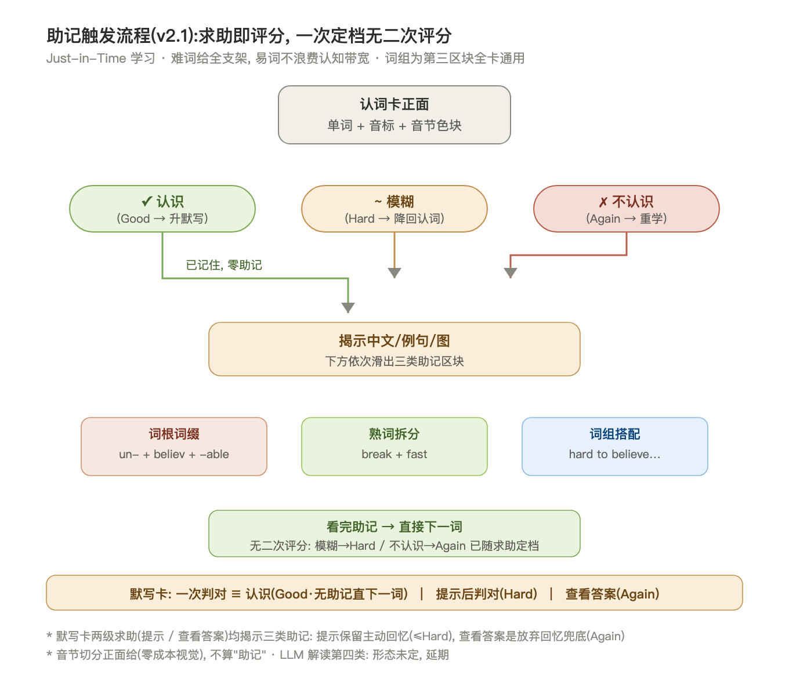
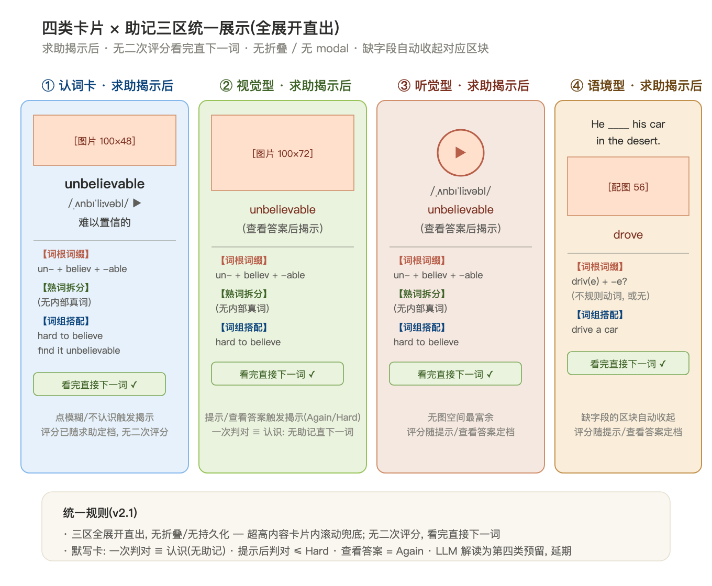
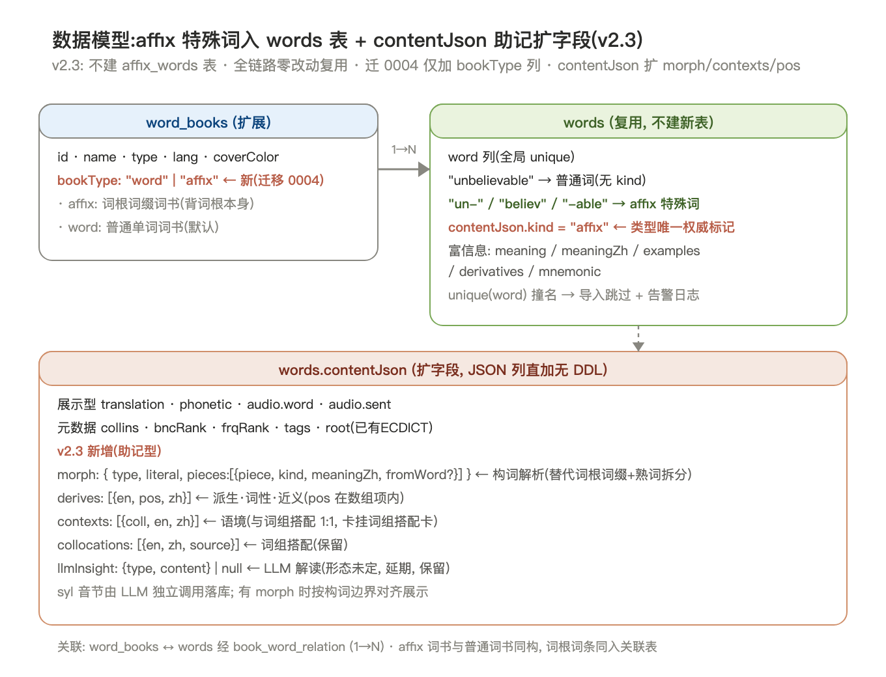
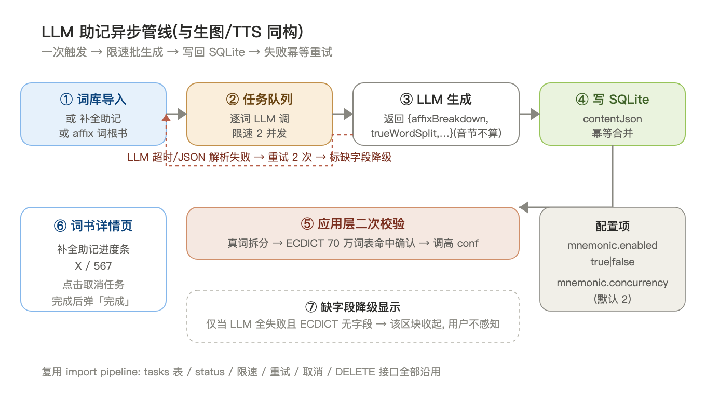

# 单词助记系统设计

> **背景**：现有认词卡只展示单词/音标/图/中文/例句，长单词即便有图仍觉得"生硬死记"。
> **核心论断**：不是展示信息不够，而是缺少**「拆词可视化 + 主动求助驱动的助记支架」**。
> **设计原则**：**JIT 学习**（Just-in-Time）—— 易词零干扰，难词倾囊相助。
> **实现路径**：音节切分（规则零成本）+ 词根词缀（LLM 批生成 + affix 特殊词入 words 表）+ 熟词拆分（LLM 批生成 + ECDICT 二次校验）。
>
> **v2 修订（2026-09-05）**：① 词组搭配升级为**所有卡片通用区块**（不再限定默写卡 Good 弹窗）；② 原"谐音联想"改为**LLM 解读**（具体形态未定，设计与实现均延期）；③ affix 词书不建独立表，词根作为**特殊 word 入 words 表**（kind 存 contentJson）；④ 删除助记区折叠设计与相关持久化。
>
> **v2.1 修订（2026-09-06）**：⑤ 助记显示后**取消二次评分**——评分随求助动作一次确定，看完助记直接下一词；⑥ 默写卡**一次判对 ≡ 认识**（无助记直接下一词），求助分两级：**提示**（用后判对最多记 Hard）→ **查看答案**（Again + 揭示三类助记）。

---

## 1. 触发机制：用户主动求助驱动



**核心交互契约**（v2.1）：

| 用户行为 | 评分 | 助记显示 |
| --- | --- | --- |
| 认词卡正面（揭示前） | — | 仅显示 **音节色块** + **音标**（属于"音形图"必要信息，非助记） |
| 认词卡点 **认识** ✓ | Good | 直接跳下一词，**无任何助记**（已记住不浪费认知带宽） |
| 认词卡点 **模糊** ~ | Hard | 揭示中文/例句/图 + 立即依次滑出三类助记：**词根词缀 / 熟词拆分 / 词组搭配** |
| 认词卡点 **不认识** ✗ | Again | 同模糊路径，揭示 + **同样的三类助记** |
| 助记显示后 | （已定） | **无二次评分**——评分已随求助动作确定，看完助记点任意处/自动进下一词 |
| 默写卡一次 **判对** | Good | ≡ 认识：直接跳下一词，**无助记**（拼对即掌握信号，与认词卡"认识"同逻辑） |
| 默写卡点 **提示** 后判对 | Hard | 揭示答案 + 三类助记（用过提示，最多记 Hard） |
| 默写卡点 **查看答案** | Again | 揭示答案 + 三类助记（彻底求助，记 Again） |

**交互要点**：

- **一次评分**：求助即评分。认词卡三键、默写卡"判对/提示/查看答案"各档动作直接映射 FSRS 评分，助记展示不附加第二轮按钮——减少一次决策，复习节奏更快
- **默写卡两级求助**：「提示」给部分线索（如首字母/词根闪现），保留主动回忆；「查看答案」是放弃主动回忆的兜底。两级都揭示三类助记，但评分档位不同（Hard vs Again）

**为什么这样设计**：

- 用户点"认识"（认词卡）/ 拼对即判（默写卡）= 已掌握信号 → 系统信任记忆 → 不堆信息
- 用户点"不认识/模糊/提示/查看答案"= 主动求助信号 → 系统倾囊相助：词根、熟词、词组三区同框
- 这把"评分"和"助记强度"做了**用户主动选择**的耦合，**比"按词长阈值给助记"更尊重用户**；且评分随求助一次确定，助记后不设二次评分，交互链路更短

理论依据：**Just-in-Time 学习**（JIT）—— 困难时即时获取支架（Scaffold），简单时不浪费认知带宽。

---

## 2. 三种助记机制详细设计

### 2.1 音节切分（规则引擎，零数据成本）

**算法**：按元音峰位切分（a/e/i/o/u + 词尾 y）

```
unbelievable → un · be · liev · able
international → in · ter · na · tion · al
congratulations → con · gra · tu · la · tions
```

**阈值**：所有词都切，不做长度筛选（短词 `cat → cat` 单段显示，不占空间）

**视觉**：四段配色（首段蓝 / 次段绿 / 三段橙 / 尾段红），与音节分组对应——眼睛一扫节奏感即出

**数据来源**：**运行时计算**，不落库（每次前端 `contentJson.word` 调 `syllableSplit()` 即可）

**与词根对齐的展示优先级**：纯元音峰规则是**语音学**切分，与 LLM 给出的**形态学**边界（如 liev/able 各成一段）可能不一致。渲染时**有 `affixBreakdown` 则优先按词根边界展示音节**，规则引擎结果只做兜底——保证"读的节奏"和"构词逻辑"在视觉上统一。

**为什么零成本**：元音规则 + 简单排除（如连续元音属同一音节），100 行 TS 函数，零 LLM 调用

### 2.2 词根词缀拆解（LLM 批生成 + affix 特殊词入 words 表）

**两层含义**：
- **A. 单词维度的辅助字段**：每个 word 的 `contentJson.affixBreakdown[]`，揭示后呈现"un-否定前缀 + believ 词根 + -able 形容词后缀"
- **B. affix 特殊词**：高频词根词缀（~200 个）作为**特殊 word 直接入 words 表**（不建独立 affix_words 表），`contentJson.kind = "affix"` 标记类型，词根正文存 `word` 列（如 `un-`、`believ`、`-able`），富信息存 contentJson。用户可选 affix 词书加入背词计划**直接背词根本身**（如 `believ = 相信` + 例词列表 + 助记钩子）

**为什么不建独立表**：word_progress / 选词 API / FSRS 调度 / 复习链路全部以 `words.id` 为主键挂载，独立表意味着整条学习链路要为 affix 再做一遍。affix 以特殊词身份入 words 表后，**调度、进度、复习零改动全链路复用**。

**唯一性约定**：words 表 `unique(word)` 全局唯一，affix 词用**带连字符的规范拼写**（`un-` / `-able`）与真词天然区分；无连字符词根（如 `believ`、`photo`）与真词撞名时，导入脚本检测 `unique(word)` 冲突并跳过 + 日志告警（撞名词根极少，人工改名缀形式即可，如 `believ-`）。`contentJson.kind` 是类型判定的**唯一权威依据**，前端不靠拼写猜。

**affix 特殊词的 contentJson 结构**：

```typescript
// words.contentJson，kind = "affix" 时
{
  kind: "affix",            // 类型标记（唯一权威判定）
  meaning: string;          // 词根英文释义
  meaningZh: string;        // 词根中文释义
  examples: string[];       // 词根出现的常见单词
  derivatives: string[];    // 派生的同根词
  mnemonic: string;         // 词根本身的助记
  collocations?: string[];  // 高频搭配（可选）
}
```

**数据源**：**LLM 批生成**（与生图/TTS 同构的异步管线，导入词库时一次性生成）

**LLM prompt 输出格式**（JSON Schema）：

```json
{
  "affixBreakdown": [
    {"piece": "un-",    "kind": "prefix", "meaning": "not",      "meaningZh": "否定"},
    {"piece": "believ", "kind": "root",   "meaning": "believe",  "meaningZh": "相信"},
    {"piece": "-able",  "kind": "suffix", "meaning": "able to",  "meaningZh": "能…的"}
  ]
}
```

> 注：音节切分运行时算（见 §2.1），LLM 不重复输出 syllables，省 token。

**示例**（believ 词根）：

| word | kind | meaning | examples | derivatives |
| --- | --- | --- | --- | --- |
| believ | affix | 相信 | believe, belief, unbelievable, disbelieve | believable, believer |
| un- | affix | 不 | unable, unhappy, unfair, uncertain | — |
| -able | affix | 能…的 | readable, comfortable, reliable | — |

### 2.3 熟词拆分（LLM 批生成 + ECDICT 二次校验）

**为什么需要二次校验**：LLM 给出的候选拆分是"主观自信"，ECDICT 70 万词条作为通用兜底提供"客观词典证据"，覆盖远超任何学习词书。

**算法**：

```
1. LLM 给定单词，输出候选拆分 [{piece, start, meaning, conf}]
2. 应用层校验:
   - piece.length ≥ 3 才考虑(避免 he/in 假阳性)
   - piece 是否在 ECDICT 词表 → 是: isRealWord=true, conf += 0.3
   - piece 是否在用户已背 words 表 → 是: conf += 0.1 + 强着色
3. 阈值: 最终 conf ≥ 0.7 → 入选并显示; 否则降级为灰色虚线(提示但不显眼)
```

**实际效果**：

| 单词 | LLM 拆分 | ECDICT 校验 | 结果 |
| --- | --- | --- | --- |
| breakfast | break + fast | 都命中 | **双高亮**（绿底 + 词内独立释义） |
| parenthesis | paren + thesis | 都命中 | 双高亮 |
| photograph | photo + graph | 都命中 | 双高亮 |
| unkind | un + kind | kind 命中 | 单高亮 |
| unbelievable | un + believ + able | 都命中但非真词 | **不显示**（拆完仍是词根，非真词） |

**视觉**：`break` / `fast` 等真词块加色底 + 加边框；非真词块保持普通文本

### 2.4 LLM 解读（原谐音联想位，设计延期）

**定位**：词根词缀 / 熟词拆分 / 词组搭配之外的第 **四** 类辅助——由 LLM 对难词做**自由解读**（可能的方向：联想故事、意象画面、语义钩子等，**具体形态未想清楚，设计与实现均延期**）。

**为什么延期**：

- 前三类已覆盖绝大多数难词的结构性需求，第四类属锦上添花
- 自由解读没有结构规律可校验，形态不定（一段话？一张图？一条联想链？）——需要先在实际背词场景里观察"用户在哪些词上仍然卡住"，再反推解读应该长什么样
- 强行先设计容易做成"LLM 硬塞的噪音"，不如让真实使用数据驱动形态

**预留字段**（暂不实现、不生成，仅占位防将来迁移）：

```typescript
words.contentJson.llmInsight: {
  type: string,        // 解读形态（story | image | …，待定）
  content: string,     // 解读正文（待定）
} | null
```

### 2.5 词组搭配（所有卡片通用区块）

**定位**：词组搭配是**三类助记之一**，与词根词缀 / 熟词拆分**同级同位**——任何卡片在揭示后都显示，不再走独立 modal、不再限定"默写卡 Good 后弹出"。

**显示规则**：

| 场景 | 行为 |
| --- | --- |
| 认词卡点模糊 / 不认识（揭示后） | 中文下方依次滑出：词根词缀 / 熟词拆分 / **词组搭配**，看完直接下一词（无二次评分） |
| 默写卡点 **提示** / **查看答案** 后揭示 | 同样显示三类助记区块，词组搭配在内 |
| 默写卡一次判对 / 认词卡点认识（跳过） | 无任何助记（含词组），直接下一词 |
| 字段缺失 | 自动收起该区块，用户无感知 |

**数据结构**（新字段，不和 examples 合并）：

```typescript
words.contentJson.collocations: [{
  en: string;       // 词组英文
  zh: string;       // 词组中文
  source: string;   // 来源: "llm" | "user" | "coca" (预留)
}]
```

**显示位置**：揭示后卡片内，词根词缀 / 熟词拆分区块之后，第三区块。样式与另两区一致（小字号、非加粗、不抢视觉）。

---

## 3. 视觉分层设计

### 3.0 视觉分层总览图



**当前布局约定**（用户已定）：图片位于卡片**顶部**，单词 / 音标 / 中文位于图片下方。本节设计保留该布局，仅在揭示后增加助记三区（在中文下方追加）。

**正面态（揭示前）**：
```
┌─────────────────────────────────┐
│   [图片占位 · 100×60]           │ ← 顶部,与现有认词卡一致
│   unbelievable                  │ ← 单词
│   un · be · liev · able         │ ← 音节(色块,与音标同行)
│   /ˌʌnbɪˈliːvəbl/  ▶           │ ← 音标+喇叭
│                                 │
│   [认识] [模糊] [不认识]        │
└─────────────────────────────────┘
```

**揭示后态（认词卡：已点模糊 / 不认识；默写卡：已点提示 / 查看答案）**：
```
┌─────────────────────────────────┐
│   [图片占位 · 100×60]           │ ← 顶部,不变
│   unbelievable                  │ ← 单词
│   /ˌʌnbɪˈliːvəbl/  ▶           │ ← 音标
│   难以置信的                     │ ← 中文释义
│   ──────────────────────         │
│   【词根词缀】                   │
│     un- 否定 + believ 相信      │
│     + -able 能…的                │
│   【熟词拆分】                   │
│     (本词无内部真词, 不显示)     │
│   【词组搭配】                   │
│     • hard to believe           │
│     • find it unbelievable      │
│   ──────────────────────         │
│   (看完直接下一词, 无二次评分)   │
└─────────────────────────────────┘
```

**视觉规则**：

- 助记三区（词根词缀 / 熟词拆分 / 词组搭配）**全部可选显示**，缺字段自动收起该区块（用户不感知）
- 三区在**所有卡片类型**上行为一致：认词卡求助揭示后、默写卡提示/查看答案揭示后统一展示，无折叠、无 modal
- 助记文字字号小（10-11px）、非加粗，与主词区分（不抢视觉）

### 3.1 各卡型空间核算（无折叠，全展开直出）

助记三区全展开直出，按各卡型核算高度（单卡理想高度 ≤ 400px）：

```
认词卡(揭示后) = 图片 100 + 单词 40 + 音标 25 + 中文 25
               + 助记三区 ≈ 120 + 下一词触发区 50
               = 360px ✓

视觉型默写卡   = 图片 100 + 答案展示 60 + 音标 25
               + 助记三区 ≈ 120 + 下一词触发区 50
               = 355px ✓

听觉型默写卡   = (无图) + 答案展示 60 + 音标 25
               + 助记三区 ≈ 120 + 下一词触发区 50
               = 255px ✓ 富余

语境型默写卡   = 配图 80 + 例句答案 60 + 输入区 30
               + 助记三区 ≈ 120 + 下一词触发区 50
               = 340px ✓

→ 四类卡全展开均在 400px 内，无需折叠；若个别超长内容(多释义/多搭配)
  溢出，卡片内部 overflow-y 滚动兜底，不做交互折叠。
```

### 3.2 contentJson 字段存储说明

**答**：是的，contentJson **完整存储**拆分后的 piece 和释义，不只是索引/外键。原因：

- **渲染零依赖**：前端不需要再去 ECDICT 查 piece 是否真词、不需要再调 LLM 问释义，所有渲染数据一次性到位
- **审计可追溯**：用户对某词的助记有疑问时，看 contentJson 就能知道 piece 和释义从哪里来（LLM 生成时连 piece + 释义一起出）
- **避免 N+1 查询**：认词卡的渲染在客户端，一次取出 contentJson 即可，无需异步查词库

具体字段结构：

```typescript
// 词根词缀(完整存储 piece + 释义)
words.contentJson.affixBreakdown: [
  { piece: "un-",    kind: "prefix", meaning: "not",     meaningZh: "否定" },
  { piece: "believ", kind: "root",   meaning: "believe", meaningZh: "相信" },
  { piece: "-able",  kind: "suffix", meaning: "able to", meaningZh: "能…的" }
]

// 熟词拆分(完整存储 piece + 释义 + 真词标记 + 置信度)
words.contentJson.trueWordSplit: [
  { piece: "break", start: 0, meaning: "打破", meaningZh: "打破", isRealWord: true,  conf: 0.92 },
  { piece: "fast",  start: 5, meaning: "斋戒", meaningZh: "斋戒", isRealWord: true,  conf: 0.91 }
]

// 词组搭配(完整存储搭配 + 释义)
words.contentJson.collocations: [
  { en: "hard to believe", zh: "很难相信", source: "llm" },
  { en: "find it unbelievable", zh: "觉得难以置信", source: "llm" }
]
```

**释义生成时机**：LLM 一次性给出 piece + piece 释义 + 中文，**不二次查询**（避免 N+1 + 成本叠加）。ECDICT 仅用于二次校验 piece 是否真词（`isRealWord` 标记），不参与释义生成。

---

## 4. 数据模型



### 4.1 迁移 0004

```sql
-- 1. affix 词根作为特殊 word 入 words 表(不建独立表)
--    复用现有 words 表结构, 无 DDL; 差异全部在 contentJson 内:
--    contentJson.kind = "affix"  ← 类型唯一权威标记
--    word 列存词根规范拼写(带连字符: "un-" / "-able"; 无连字符词根
--    与真词撞名时导入脚本检测 unique(word) 冲突并跳过+告警)

-- 2. word_books 加 bookType 列(标记词书用途, 供词书中心筛选展示)
ALTER TABLE word_books ADD COLUMN bookType TEXT NOT NULL DEFAULT 'word';
-- 'word' = 普通单词词书(默认); 'affix' = 词根词缀词书(成员是 affix 特殊词)

-- 3. words.contentJson 扩字段(无需 schema 变更, JSON 列直接加)
--   affixBreakdown: Array<{piece, kind, meaning, meaningZh}>
--   trueWordSplit: Array<{piece, start, meaning, meaningZh, isRealWord, conf}>
--   llmInsight: {type, content} | null   (LLM 解读, 延期实现)
--   collocations: Array<{en, zh, source}>
```

### 4.2 字段语义说明

| 字段 | 用途 | 写入时机 | 缺字段处理 |
| --- | --- | --- | --- |
| `syllables` | 音节切分 | **运行时算**（不落库） | 永远存在 |
| `affixBreakdown` | 词根词缀拆解 | LLM 批生成 | 缺 → 隐藏词根区块 |
| `trueWordSplit` | 熟词拆分 | LLM 批生成 + ECDICT 校验 | 缺 → 隐藏熟词区块 |
| `llmInsight` | LLM 解读 | LLM 批生成（**延期**） | 缺 → 隐藏解读区块 |
| `collocations` | 词组搭配 | LLM 批生成 | 缺 → 隐藏词组区块 |
| `contentJson.kind` | affix 特殊词标记 | 导入词根时写入 | 普通词无此字段 |

---

## 5. LLM 异步生成管线



**与生图/TTS 同构**，复用 import pipeline：

```
1. 词库导入触发 → ② 任务队列逐词 → ③ LLM 生成 → ④ 写 SQLite
                                                        ↓
                                                  ⑤ 应用层二次校验
                                                        ↓
                              ⑥ 词书详情页进度条展示 ←──── ⑦ 缺字段降级
```

**复用现有机制**：
- `tasks` 表（status / 进度 / 取消）—— 与生图任务同表，taskType=mnemonic
- 限速（默认 2 并发，可在 `app_settings.mnemonic.concurrency` 调）
- 失败重试 2 次（指数退避）→ 失败标缺字段
- DELETE 接口（取消任务）
- `importing[]` 幽灵卡防护（任务取消后不渲染）

**新增配置项**（`app_settings`）：
```typescript
mnemonic.enabled: boolean          // 总开关(默认 true, 生图失败/慢时可关)
mnemonic.concurrency: number       // 并发(默认 2)
mnemonic.retries: number           // 重试(默认 2)
```

**affix 词根入库**：词根书导入走同一管线——逐词根 LLM 生成 meaning/examples/derivatives/mnemonic，以特殊 word 写入 words 表（`contentJson.kind="affix"`）+ 建与 affix 词书的 book_word_relation。

**进度可视化**：词书详情页顶部进度条 `X / 567` + 「补全助记」按钮 + 完成后弹「已完成」

---

## 6. 实现优先级

| 阶段 | 内容 | 数据依赖 | 工作量 |
| --- | --- | --- | --- |
| **P1.1** | 音节切分（vowel split 规则，affix 优先对齐） | 零 | 1 文件，~100 行 TS |
| **P1.2** | 词根词缀：affixBreakdown 字段 + 揭示后渲染 | LLM 批生成 + 字段扩 | 字段扩 + UI 区块 + LLM prompt |
| **P1.3** | affix 特殊词导入（入 words 表 + kind 标记 + bookType=affix 词书 + 词书详情适配） | 迁移 0004 + 导入脚本 | 导入脚本 + UI 类型适配（调度链零改动） |
| **P1.4** | 熟词拆分（trueWordSplit + LLM + ECDICT 校验 + 渲染） | LLM 批生成 + ECDICT 查询 | 字段扩 + 渲染 + ECDICT 集成 |
| **P1.5** | 词组搭配（collocations + 三区同框渲染） | LLM 批生成 | 字段扩 + 渲染 |
| **P1.6** | 「补全助记」按钮 + 进度可视化 + 配置项 | app_settings 扩字段 | UI + 管线 |
| P2 | LLM 解读（llmInsight，形态待定，观察真实卡词场景后再设计） | LLM 批生成 | 待定 |

---

## 7. 验证方法

### 7.1 数据层验证

```bash
sqlite3 data/app.db "SELECT word, content_json FROM words WHERE word IN ('unbelievable','breakfast','ambulance')" | jq
# 检查:
#   - affixBreakdown 含 prefix/root/suffix 三段
#   - trueWordSplit 中 ECDICT 命中的 piece isRealWord=true
#   - collocations 有 2-3 条带中英
sqlite3 data/app.db "SELECT word, content_json FROM words WHERE json_extract(content_json,'$.kind')='affix' LIMIT 5" | jq
# 检查: affix 特殊词 kind 标记 / meaning / examples / derivatives 齐全
```

### 7.2 UI 验证（agent-browser）

```
1. 打开 /learn → 选任意长词(单词背词流程)
2. agent-browser eval 点击 .rate-btn[data-rating="again"] (不认识)
3. eval 检查 .mnemonic-affix / .mnemonic-split / .mnemonic-collocations DOM 存在性
4. eval 确认揭示态无二次评分按钮([再认]/[还模糊] 不存在), 看完可直达下一词
5. 默写卡: 一次判对 → 断言直接跳下一词且无助记; 点提示/查看答案 → 断言三类区块存在
6. 截图前/后两个态对比
7. 验证「补全助记」按钮 + 进度条:
   - 点 → 任务队列出现
   - 后端日志看 LLM 调用次数与成功率
   - 完成后 contentJson 字段被填充
```

### 7.3 边界用例

- 单词极短（cat、run）：无 affix、无拆分、无搭配，但有 syllables（单段）
- 单词极长（uncharacteristically）：syllables 多段（5-6 段），affix 三段（pre+root+suffix）
- LLM 全失败：词书详情页状态显示「补全失败 N 个」，用户可单条重试
- 用户已背词在拆分中：ECDICT 命中 + 用户词库命中 → 强着色
- affix 词根与真词撞名（believ）：导入脚本检测 unique(word) 冲突跳过 + 告警日志

---

## 8. 关键设计取舍

**取舍 1：为什么不直接在 ECDICT 加字段？**

ECDICT 是**通用词典**，不含词根词缀（"believ=相信" 这种派生分析是教学/形态学产物，非词典本身职责）。所以 ECDICT 可作「真词字典」兜底，但**词根词缀必须靠 LLM 生成**。

**取舍 2：为什么音节切分不落库？**

音节切分是**纯算法**（元音峰位规则 + 几个例外），每次调 100 行函数成本 < 1ms，没必要占 SQLite 行空间。LLM 也不"顺便"算音节（省 token + 避免与规则引擎结果不一致）——渲染时**有 affixBreakdown 则按词根边界对齐展示**，规则引擎只做兜底。

**取舍 3：为什么熟词拆分需要二次校验（不只是 LLM 直接给）？**

LLM 单次输出的 `conf` 是**主观评分**，与"该子串在通用词典的存在性"是两个独立证据。两证据**交叉验证** → 最终置信度更可靠。
- LLM 标 conf=0.8 + ECDICT 命中 → 真实 conf≈ 0.9
- LLM 标 conf=0.8 + ECDICT 未命中 → 真实 conf≈ 0.5（可能 LLM 自信但实际拼错或生僻）

**取舍 4：为什么 affix 词根入 words 表，不建独立 affix_words 表？**

word_progress（UNIQUE wordId）、选词 API、FSRS 调度、复习 session 全链路以 `words.id` 挂载。独立表意味着：进度表泛化为 (itemType, itemId)、选词/调度/复习各改一遍——**为一个词书类型改动整条学习链路，不值**。affix 作为特殊词入 words 表后：
- 调度/进度/复习**零改动**全链路复用
- 类型判定唯一依据 `contentJson.kind`（不靠拼写猜）
- 代价仅是 `unique(word)` 撞名处理（导入脚本检测冲突跳过 + 告警，撞名词根极少）

**取舍 5：为什么词组搭配和词根/熟词同级显示，不搞独立触发？**

三区的服务对象是同一个：**正在攻关这个难词的用户**。词组展示"这个词实际怎么用"，与词根（构词来源）、熟词（已知子词）是同一场景下的互补信息，拆成不同触发场景（v1 的"默写 Good 后弹 modal"）徒增交互分支且信息割裂——统一为揭示后三区同框，简单直接。

**v1 → v2 关键变更**：

| 项 | v1 | v2（本版） |
| --- | --- | --- |
| 词组搭配 | 默写卡 Good 后独立 modal | **所有卡片揭示后第三区块** |
| 谐音联想 | P2 预留 mnemonic 字段 | 改为 **LLM 解读**（llmInsight），设计延期 |
| affix 词书存储 | 独立 affix_words 表（迁移 0004） | **特殊 word 入 words 表**（kind 存 contentJson） |
| 助记区折叠 | 三型卡差异化折叠 + sessionStorage/app_settings 持久化 | **删除**：全展开直出，超高滚动兜底 |
| 助记后二次评分 | 再认→Good / 还模糊→Hard | **删除**：评分随求助动作一次确定（v2.1） |
| 默写卡求助 | 判对即揭示助记 | **判对≡认识**（无助记直下一词）；求助两级：提示(≤Hard)→查看答案(Again)（v2.1） |

---

## 9. 关联 commit / 记忆

| 时间 | 事件 | 位置 |
| --- | --- | --- |
| 2026-09-06 | v2.1 修订：删二次评分（评分随求助一次确定）+ 默写卡判对≡认识、提示/查看答案两级求助 | `docs/单词助记系统设计.md` |
| 2026-09-05 | v2 修订：词组全卡通用 / LLM 解读延期 / affix 入 words / 删折叠 | `docs/单词助记系统设计.md` |
| 2026-09-04 | v1 定稿 | `docs/单词助记系统设计.md` |
| 2026-09-04 | contentJson 已支持 ECDICT 富字段 | `scripts/enrich-words-ecdict.mjs` |
| 2026-09-03 | TTS 异步管线（参考设计） | commit a8c610d |
| 2026-09-02 | 生图异步管线（参考设计） | commit 48de959 |

---

## 附录 A：示例内容（unbelievable）

**音节**：`un · be · liev · able`（有 affixBreakdown 时按词根边界对齐展示）

**词根词缀**：
| piece | kind | meaning | meaningZh |
| --- | --- | --- | --- |
| un- | prefix | not | 否定 |
| believ | root | believe | 相信 |
| -able | suffix | able to | 能…的 |

**熟词拆分**：（无内部真词）

**词组搭配**：
- hard to believe（很难相信）
- find it unbelievable（觉得难以置信）
- it seems unbelievable that…（…看起来难以置信）

**LLM 解读**：（延期，暂无）

---

## 附录 B：affix 特殊词示例（believ 词根）

```json
{
  "word": "believ",
  "入库说明": "挂在 bookType=affix 的词书下(book_word_relation 正常建), words 表 unique(word) 撞名时跳过+告警",
  "contentJson": {
    "kind": "affix",
    "meaning": "believe",
    "meaningZh": "相信",
    "examples": ["believe", "belief", "unbelievable", "disbelieve"],
    "derivatives": ["believable", "believer"],
    "mnemonic": "believ = believe 简写, 同 receive/ceive 的拼写规律"
  }
}
```
