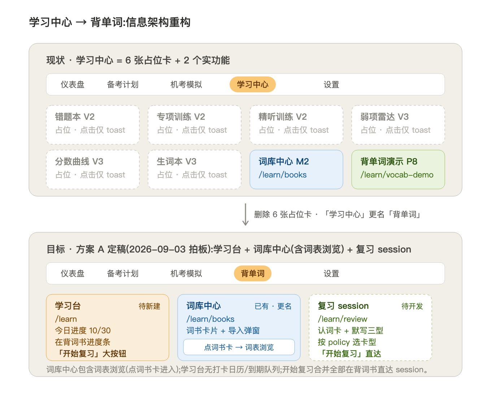
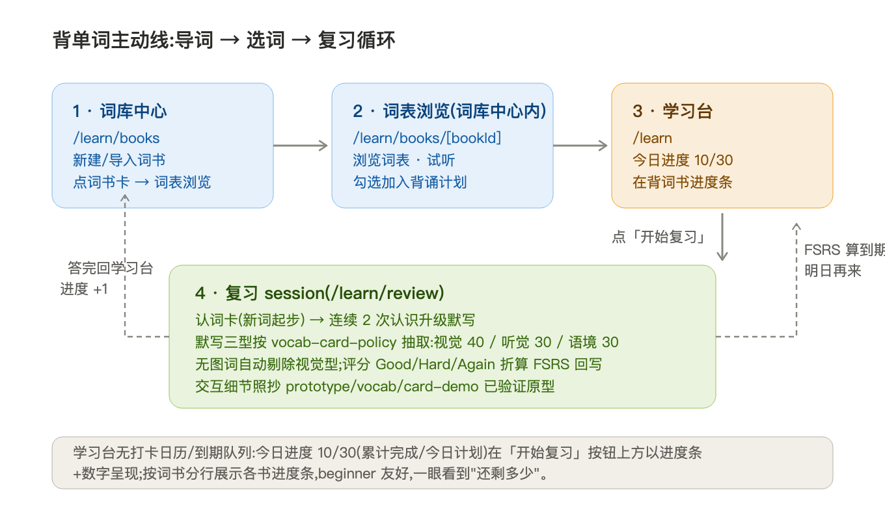

# 学习中心重构 · 背单词页面编排规划

> 版本 v1.1 · 2026-09-03 · 状态:**方案定稿(已拍板),未动手**
> 决策来源:用户拍板——学习中心 6 张占位卡全部删除;词库管理改名**词库中心**且**包含词表浏览**(点词书卡进入);学习台不做到期队列、不做打卡日历,改为**今日进度 10/30 + 词书进度条 + 开始复习大按钮**。

## 1. 现状盘点

| 位置 | 现状 | 判定 |
|---|---|---|
| topbar「学习中心」 `/learn` | 8 张功能卡,6 张纯占位(点击仅 toast) | **整页删除** |
| `/learn/books` 词库中心 | 已上线:卡片网格 + 新建/导入弹窗 + 四步进度 | **保留,更名「词库中心」** |
| `/learn/vocab-demo` 背单词演示 | P8 垂直切片:词列表 + 详情 + 音频,写死 ielts-core-pilot | 过渡保留,词表浏览页上线后**退役** |
| 顶部导航 | 仪表盘 / 备考计划 / 机考模拟 / 学习中心 / 设置 | 「学习中心」→「背单词」 |

全站对 `/learn` 的引用仅 3 处:topbar 导航项、`learn/page.tsx` 自身、vocab-demo 页头的返回链接——删除成本低,无死链风险(逐处处理)。

## 2. 页面编排(定稿)

导航只留一个「背单词」入口(挂 `/learn`),三个页面:

| 页面 | 路由 | 状态 | 职责 |
|---|---|---|---|
| **学习台** | `/learn` | 待新建 | 今日进度 10/30、在背词书进度条、大按钮「开始复习」 |
| **词库中心** | `/learn/books` | 已有(更名) | 词书卡片 + 新建/导入弹窗;**点词书卡 → 进入词表浏览** |
| **词表浏览**(词库中心内) | `/learn/books/[bookId]` | 待新建(正式化 vocab-demo) | 词表浏览、试听、看释义;每词「加入/移出背诵计划」勾选 |
| **复习 session** | `/learn/review` | 待开发 | 认词卡 + 默写三型,交互照抄 card-demo 原型,卡型按 vocab-card-policy 抽取 |

结构说明:词表浏览不是第四个一级页面,它是词库中心的下钻页(`/learn/books/[bookId]` 本就是子路由),与用户「词库中心应包含词表浏览」的直觉一致。

**动线**:词库中心导词 → 点词书卡进词表选词入计划 → 学习台看到今日进度 → 点「开始复习」进 session → 答完回学习台进度 +1,FSRS 算出明日到期。

### 学习台首屏设计(回答两个拍板问题)

**① 今日进度 10/30 怎么放**:不用单独卡片,直接做进「开始复习」按钮的本体——按钮上方一根进度条(已完成 10 / 今日计划 30),按钮文案带数字(如「开始复习 · 还剩 20 词」)。完成 30/30 后按钮变「今日已完成 ✓」的完成态,但仍可点进去自由复习。

**② 词书进度条怎么展示**:在学习台下半区按**在背词书分行**展示,每行 = 词书名 + 细进度条 + 「已学 X / 总 Y 词」。多本在背就多行;只有一本时同样展示(保持结构稳定)。每行可点,直达该词书的词表浏览页。数据源现成:`/api/vocab-book` 已返回每书 imageCount,补一个 per-book 已学计数即可(word_progress 按 bookId 聚合)。

**③ 「开始复习」点击后去哪**:**`/learn/review` 复习 session,是的**。session 一次合并**全部在背词书**的今日到期词(FSRS due ≤ now),不按词书拆分——背单词的用户心智是"今天要背完今天的量",不是"先背 A 书再背 B 书"。词书只作为进度展示维度,不作为复习入口维度。将来若要"只复习某本书",在词书进度条行尾加个小复习按钮即可,首版不做。

## 3. 删除与保留清单

**删除(落地时一次做)**:
- `src/app/(shell)/learn/page.tsx` 现内容(8 卡占位页)→ 被「学习台」重写取代
- topbar「学习中心」label → 「背单词」
- vocab-demo 页头「← 学习中心」返回链接(随 vocab-demo 退役一并处理)

**保留不动**:
- `/learn/books` 全部(页面 + `/api/vocab-book` 系列接口),仅页面标题文案改「词库中心」
- `/api/vocab-study-plan`(选词入计划 API 已就绪,词表浏览页直接消费)
- word_progress / word_review_log 数据层与 FSRS 调度(学习台"今日进度 10/30"的数据源)
- `vocab-card-policy.ts`(复习 session 选卡型的既定约束)
- 设置页「备考」分区各卡(阈值/配图风格/音色都属于背单词,留在设置页不动)

**退役(条件触发)**:
- `/learn/vocab-demo`——等 `/learn/books/[bookId]` 词表浏览页上线并覆盖其能力(词列表/音标/音频/释义)后删除。删前它是唯一能听音频、看词详情的界面,先留着不碍事。

## 4. 实施顺序建议

1. **S1 门户切换**(小):topbar 改名;`/learn` 先用极简学习台占位(今日进度 + 开始复习按钮 + 词库中心入口),让导航语义先正确
2. **S2 词库中心下钻**(中):`/learn/books/[bookId]` 词表浏览页正式化 vocab-demo 能力 + 「加入背诵计划」勾选(word_progress 联动);词书卡整体可点
3. **S3 复习 session**(大):`/learn/review` 移植 card-demo 交互(认词卡 + 默写三型 + 音效 + 判分),接 vocab-card-policy 与 FSRS 回写;「开始复习」在 S3 前先指向占位页,S3 完成后直达
4. **S4 学习台完整版**(中):词书分行进度条(真实数据)、复习完成回执;vocab-demo 退役

S1 独立可交付;S2/S3 顺序可互换(S3 也可先行);S4 收尾。

## 5. 拍板记录

| 问题 | 决定 |
|---|---|
| 方案 A(学习台为家) vs B(词库为家) | **A**,2026-09-03 拍板 |
| 导航名 | **「背单词」**(隐含接受,未另行反对) |
| 词库管理命名 | **改名「词库中心」**,且包含词表浏览(点词书卡进入) |
| 学习台内容 | **去掉**今日到期队列、打卡日历;改为**今日进度 10/30** + 词书进度条 + 开始复习大按钮 |
| 开始复习去哪 | 复习 session `/learn/review`,一次合并全部在背词书 |
