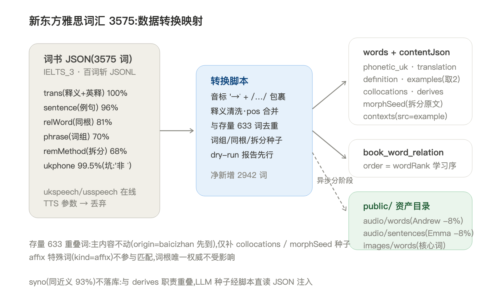
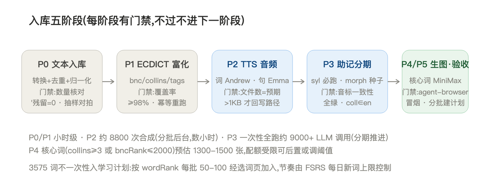

# 新东方雅思词汇 3575 入库计划

> 状态:**待拍板**(§7 决策点确认后动工) · 2026-09-07
> 数据源:`~/Downloads/新东方雅思词汇.json`(bookId=IELTS_3,百词斩导出 JSONL,5.8MB,3575 词)
> 关联:`docs/单词助记系统设计.md` §2.4(v2.8 collocations 回归)、`scripts/backfill-collocations.mjs`(已上线)

## 1. 背景与目标

现库仅两本词书:雅思核心 100 词(P8 测试切片)+ 雅思核心词汇 563,合计 words 表 647 行(含 14 个 affix 特殊词)。主流雅思核心词库规模为 3000–3500 词,563 远低于备考需求。

**目标**:以新东方雅思词汇(3575 词)为源,净新增 **2942 词**(3575 − 存量重叠 633),补齐音频/富信息/助记,形成可长期背诵的完整词库。词书标识建议 `bookId="ielts-xdf-3575"`、`name="新东方雅思词汇 3575"`、`source="builtin"`、`origin="baicizhan"`(数据同源)。

**规模基准**(2026-09-07 会话结论):核心词库 3000–3500;总词汇量 6 分 4000–5000 / 6.5–7 分 6000–7000;背词调度量级控制在 2500–3500,本库 3575 词落在区间上沿,达标。

## 2. 数据源盘点(实测覆盖率)

| 源字段 | 覆盖率 | 内容 | 去向 |
| --- | --- | --- | --- |
| `trans` | **100%** | 中文释义(tranCn)+ POS + 英文释义(tranOther) | `translation[]` / `definition[]` |
| `ukphone` / `usphone` | 99.5% / 98% | 英美音标(**重音符是 `'` 非 IPA `ˈ`**) | `phonetic_uk` / `phonetic_us`(归一化) |
| `sentence` | 96.4%(5587 句) | 中英对照例句,每词 1–3 条 | `examples[]`(取前 2) |
| `relWord` | 81% | 同根词(hwd/tran/pos) | `derives[]` **直转**(决策点 D2) |
| `phrase` | 70%(2500 词) | 词组搭配(pContent/pCn) | `collocations[]`(v2.8 已有规则) |
| `remMethod` | 67.5%(2413 词) | 词根拆分记忆法原文 | `morphSeed`(决策点 D1) |
| `syno` | 93% | 同近义词 | **不落库**(与 derives 职责重叠,LLM 种子经脚本直读 JSON) |
| `ukspeech`/`usspeech` | — | 百词斩在线 TTS 参数 | **丢弃**(离线不可用,音频走 edge-tts) |

例句性质已实测:96.9% 例句包含词头或屈折形态(围绕单词生成),仅 12.6% 例句包含词书中任一词组——**例句与词组是两套独立素材**,词组例句化通过 v2.8 回填规则维护(见 §3)。

两个已确认的坑:
1. **音标重音符**:`'kænsl` 格式(apostrophe 标重音),存量库惯例是 `/əˈbændən/`(带斜杠 + IPA `ˈ`,501/647 词含 `ˈ`)。导入须做 `' → ˈ` + 外包 `/…/` 归一化,否则 `check-phonetic-consistency.mjs` 门禁全线误报。
2. **18 词缺 ukphone**:用 ECDICT 音标补(enrich 阶段处理),仍缺的留空走运行时兜底。

## 3. 转换规则(逐字段契约)

| 源 | 目标 | 规则 |
| --- | --- | --- |
| `headWord` | `words.word` | 原样小写入库;与存量 633 词(大小写不敏感)查重,重叠词主内容**一律不动**(origin=baicizhan 先到) |
| `ukphone` | `words.phonetic_uk` | `' → ˈ`,外包 `/…/`;清洗多余空格 |
| `usphone` | `words.phonetic_us` | 同上 |
| `trans[].pos + tranCn` | `contentJson.translation[]` | 首段 `pos.段1`,余段按 "；" 拆,清洗 `tranCn` 内不规则空格(`取消， 废除` → `取消，废除`) |
| `trans[].tranOther` | `contentJson.definition[]` | 多词条合并 |
| `sentence.sentences` | `contentJson.examples[]` | 取**前 2 条** `{en, cn}`(决策点 D3);音频 P2 阶段合成回写 |
| `phrase.phrases` | `contentJson.collocations[]` | 复用 v2.8 规则:`{phrase, cn}`,去空格、词组=单词本身剔除、大小写去重 |
| 例句 ⊃ 词组 | `contentJson.contexts[]` 追加 | v2.8 回填规则:精确包含(小写、不做屈折)→ `{coll, collZh, en, cn, audio: 复用例句音频, src: "example"}`;同 coll 已存在跳过 |
| `relWord.rels` | `contentJson.derives[]` | **直转**:`hwd→word, tran→meaningZh, pos→标准缩写(n./v./adj./adv.)`,上限 5 条(决策点 D2) |
| `remMethod.val` | `contentJson.morphSeed`(新字段,string 可空) | 拆分原文整存(如 `pre(预先) + par(安排) + e → 提前安排 → 准备，预备`),gen-mnemonic 作 prompt 种子,生成 morph 后保留作血缘(决策点 D1) |
| `wordRank` | `book_word_relation.order` | 学习序即词书序(乱序版更科学,但本书为正序版,order 按原序) |

**affix 保护**:`kind=affix` 特殊词不参与任何匹配回填,词根唯一权威(contentJson.kind)不受影响——前/后缀连字符拼写避撞名的既有约定已实测 0 撞名。

## 4. 五阶段流水线

### P0 文本入库(小时级,纯脚本)

新脚本 `scripts/import-xdf-ielts.mjs`(复用 `import-vocab-pipeline.mjs` 的 better-sqlite3+drizzle 直写模式与 `backfill-collocations.mjs` 的转换规则,不与百词斩在线 API 混用):

1. 读 JSONL → 逐词转换(§3 规则)→ dry-run 报告(数量、抽样 10 词字段对拍、异常清单)
2. `--apply` 写库(自动备份 app.db):新词插 `words`(含 collocations/derives 直转/morphSeed/contexts 回填),重叠词仅补 `morphSeed`(其 collocations/contexts 已于 496e0cc 回填)
3. 建 `word_books` 行 + `book_word_relation`(order=wordRank,幂等:重复导入清旧重挂)

**门禁**:总行数 3575 / 净新增 2942 / 重叠 633 三数核对;`phonetic_uk` 含 `'` 残留 = 0;抽样对拍无 diff。

### P1 ECDICT 富化(小时级,幂等)

现有 `scripts/enrich-words-ecdict.mjs` 直接对 2942 新词跑(awk 抽行,毫秒级/词):补 `bncRank / frqRank / collins / tags / exchange`。18 个缺音标词顺带用 ECDICT phonetic 补。

**门禁**:bncRank/collins 覆盖率 ≥98%;重跑零变更。

### P2 TTS 音频(约 8800 次合成,分批后台数小时)

- 单词音频:2942 次,`en-US-AndrewMultilingualNeural --rate=-8%`(注:存量单词音频降速重跑任务仍在待办,新词直接用新参数,一次到位)
- 例句音频:约 5884 次(2942×2),`en-US-EmmaMultilingualNeural --rate=-8%`
- 沿用 ">1KB 才回写路径、失败不阻塞" 既有机制;SSL 重试已有

**门禁**:文件数=预期数;抽样 >1KB;回写率报告。

### P3 助记分期(最大成本项,分期推进)

LLM 调用量测算(净增 2942 词,四路助记):

| 路径 | 全跑调用量 | 优化后 | 依据 |
| --- | --- | --- | --- |
| syl 读音解析 | 2942 | **2942(必跑,不可替代)** | 运行时切分不落库,LLM 唯一来源 |
| morph 构词 | 2942 | 2942(67.5% 有 morphSeed 种子,准确率提升、调用数不变) | kind 判定不可靠,不直转 |
| derives 派生 | 2942 | **仅 ~560(19%)** | relWord 81% 已直转(决策点 D2) |
| contexts 语境 | 2942 | ~2600,可分期 | 例句命中词组的已回填(src=example),LLM 以 collocations 为 coll 种子 |

- **首期**:syl + morph(约 5900 调用,按 563 库经验分批)→ 每批跑 `check-phonetic-consistency.mjs` 门禁
- **二期**:derives 补缺(~560)+ contexts(按学习进度分期生成——学到哪批补哪批,不必一次性 2600)

**门禁**:音标一致性全绿;contexts 每条 coll 可在 en 中定位;结构自检(pieces/pos/coll 契约)通过。

### P4 生图(核心词,可后置)

阈值 `collins≥3 或 bncRank≤2000`(现有 `isCoreWord` 逻辑),按 563 库比例预估 1300–1500 张,MiniMax image-01 异步、失败不阻塞。

**门禁**:png >1KB 才回写 `contentJson.image`;0 字节残留不算有图(既有 `vocab-card-policy` 语义)。

### P5 验收与建计划

- agent-browser 冒烟:抽 5 词(纯文本词/带图词/长难词各取)走完整背词流,断言主卡 + 四张辐射卡 + 拼写线 + 发音
- **不一次性入学习计划**:按 wordRank 每批 50–100 词经选词页/搜索加入,节奏由 FSRS 每日新词上限控制(3575 词按每日 20 新词 ≈ 179 天,6–8 个月自然周期)

## 5. 存量 633 词的处理

| 事项 | 状态/动作 |
| --- | --- |
| collocations + contexts(src=example) | ✅ 已回填(496e0cc,476 词) |
| 主内容(translation/examples/audio/image) | 不动,保留既有资产 |
| morphSeed | P0 随批补(remMethod 覆盖的 ~428 词) |
| 补助记(syl/morph/…) | 走既有「补全助记」按钮/脚本,不混入本计划批量 |

## 6. 风险清单

| 风险 | 应对 |
| --- | --- |
| LLM 调用量大(首期 ~5900) | 分批 + 断点续跑(gen-mnemonic 已幂等);LLM 配置读 config.json,失败词清单留档重跑 |
| remMethod 质量参差 | 种子仅提升准确率,morph 仍过结构自检 + 抽样审查(563 库已建立审查-修复流程) |
| collocations 术语噪音(apparent viscosity 类,单词最多 20 条) | 素材池定位不直接渲染;LLM 种子消费时限前 N 条(建议 ≤6,决策点 D5) |
| 生图配额 | P4 可后置/调阈值,不阻塞 P5 |
| 音标归一化误伤 | 仅处理新词;' 在存量库仅 2 处(撇号类词),不碰存量 |

## 7. 待拍板决策点

| # | 决策 | 建议 |
| --- | --- | --- |
| D1 | `morphSeed` 新字段(string 可空,remMethod 原文) | **加**——gen-mnemonic 种子 + 血缘可追溯;异步「补全助记」路径也能拿到种子(否则只能批量脚本读 JSON) |
| D2 | derives 直转(relWord 81%) | **直转**——省 ~2400 次 LLM 调用,relWord 与 derives 契约完全同构;19% 无 relWord 的词走 LLM |
| D3 | 例句取几条 | **前 2 条**——语境/默写卡素材余量充足,TTS 成本可控 |
| D4 | 生图是否进本计划 | **后置**——P0–P3 完成即具备背诵条件,P4 独立推进 |
| D5 | collocations 种子上限 | **≤6 条**——喂给 gen-mnemonic context/morph prompt 的种子数 |
| D6 | contexts LLM 生成的时机 | **随学随补**——按计划批次生成,避免一次性 2600 调用积压 |

## 8. 验收总口径

- words 总行数 647 + 2942 = **3589**;book 17 词书关联 3575 行
- 三数核对通过;音标格式统一(`/ˈ…/`);`check-phonetic-consistency` 全绿
- 音频/图片回写率报告;agent-browser 冒烟 5 词通过
- 过程全部只 commit 不 push,大阶段完成后统一 push
