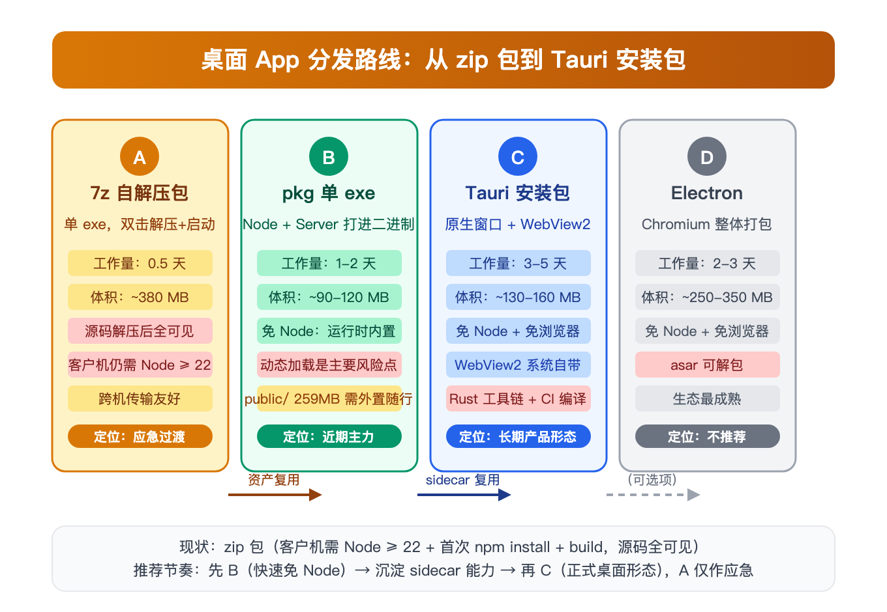

# 桌面 App 分发方案设计

> 状态：v0.2（方案 C 已实施，待 CI 出包真机验收）
> 日期：2026-09-07
> 关联文档：docs/windows-test-guide.md（zip 包测试手册）、IELTS-机考网站PRD.md §3.1「文件夹即应用」

---

## 1. 背景与目标

### 1.1 现状

应用已打通 **zip 包 + 一键启动** 的 Windows 分发链路（2026-09-07 真机验证通过）：

```
分发物：dist/ielts-copilot-win-*.zip（~123MB，源码 + public 资源）
客户机：装 Node ≥ 22 → 解压 → start.bat
       → npm install --ignore-scripts → npm run build（数分钟，需联网）→ 起服务开浏览器
```

### 1.2 痛点

1. **客户机有前置负担**：Node ≥ 22 + 首次 npm install + build，耗时数分钟且依赖网络。
2. **源码完全暴露**：整个仓库连同业务代码直接躺在客户机目录里。
3. **分发物不「产品化」**：一个装满文件的目录，而非一个可双击安装/运行的产物。
4. **路径长度坑**：Windows 自带解压会撞 MAX_PATH（0x80010135），要求 7-Zip + 短路径。

### 1.3 目标

把应用打包为 **单 exe / 桌面 App** 形态分发，达成：

| 编号 | 目标 | 判定标准 |
|---|---|---|
| G1 | 客户机免装 Node、免构建、免联网 | 全新 Win10/11 双击即可进首页 |
| G2 | 业务代码不直接可读 | 目录里看不到 src/、server.js 明文 |
| G3 | 前端样式/交互零改动 | UI 复用现有页面，不做重写 |
| G4 | 保留本地数据/配置既有语义 | SQLite、config.json、音频播放不受影响 |
| G5 | 构建产物全部在 CI 产出 | 本机不需要 Rust/交叉工具链 |

**非目标**：源码防逆向（JS 打包进 exe 不等于加密，只防「顺手翻目录」）、自动更新、代码签名（均列为远期）。

---

## 2. 打包改造的硬约束（现状审计）

无论选哪条路线，以下工程事实决定改造边界：

| 事实 | 详情 | 对打包的影响 |
|---|---|---|
| 构建链路 | `next build`(standalone) → `scripts/postbuild.mjs` 修补为 `next-server/`：server.js + drizzle-migrations + better-sqlite3 整目录 + public + .next/static | **sidecar/server 内核就是 next-server/**，已自包含可运行 |
| 原生模块 | better-sqlite3@13.0.3，包内自带 `prebuilds/win32-x64.node`，`--ignore-scripts` 免编译 | 二进制依赖 .node 文件，**无法内嵌进任何 JS 快照**，只能外置或随自解压释放 |
| 静态资源 | public/ 共 **259MB**（audio 159MB 为主，mp3 已压缩、再压缩收益低） | 决定单文件体积上限；需策略决策（见 §4.3） |
| 数据 | data/app.db + WAL，首次启动由 instrumentation 自动建库+迁移 | 运行期可写目录，不能放安装目录内只读区 |
| 敏感配置 | config.json（LLM apiKey），不入包，从 example 复制 | 打包脚本须剔除/置空，避免泄露分发者 key |
| 端口 | 3177，占用自动 +1（上限 20 次） | 桌面版生命周期复用此语义 |
| CI 现成 | `.github/workflows/build-windows-package.yml`，windows-latest runner | 桌面化构建直接挂载同一 runner |

---

## 3. 方案选型与演进路线



| 方案 | 形态 | 客户机依赖 | 体积 | 工作量 | 源码暴露 | 结论 |
|---|---|---|---|---|---|---|
| A. 7z SFX | 单 exe 自解压 | Node ≥ 22 | ~380MB | 0.5 天 | 全可见 | **应急过渡** |
| **B. pkg 单 exe** | 单 exe 双击运行 | **免 Node** | 90-160MB* | 1-2 天 | 不可直接读 | **近期主力** |
| **C. Tauri 安装包** | 原生窗口 + WebView2 | **免 Node、免浏览器**（WebView2 系统自带） | 130-160MB* | 3-5 天 | 不可直接读 | **长期产品形态** |
| D. Electron | 原生窗口 + Chromium | 免 Node | 250-350MB | 2-3 天 | asar 可解包 | 不推荐（体积/推翻既有决策） |

> *：受 public/ 259MB 制约，见 §4.3 体积决策。

### 3.1 决策要点

1. **B 先行、C 演进，且 B 的产物是 C 的基石**：B 打出的 server exe 可直接作为 C 的 sidecar，资产不浪费。
2. **前端代码（src/、样式、主题）零改动**：C 用 WebView2 渲染同一套页面，API/SQLite 层原样跑在 sidecar 里。
3. **D 排除**：体积最大、推翻「不用 Electron」的既有架构决策，且无可挽回优势。

---

## 4. 阶段 B：单 exe 分发（免 Node）

### 4.1 内核选择：打什么进 exe

待选内核即现有 `next-server/` 目录——已通过 postbuild 自包含（见 §2）。关键问题变成 **如何让 Node 运行时 + next-server 变成一个 exe**。

### 4.2 三条打包技术路线（需 P0 Spike 验证）

| 路线 | 机制 | 优势 | 已知风险 |
|---|---|---|---|
| **yao-pkg**（vercel/pkg 维护分支） | 快照式：node 运行时 + 入口打进 exe，next-server 整树挂虚拟 fs | 真单文件；生态成熟 | **Next standalone 按需 require chunks（动态 require + __dirname 拼接）与 pkg 虚拟 fs 的兼容性是历史顽疾**；better-sqlite3 .node 无法快照，须外置 → 破坏「单文件」 |
| **Node SEA**（官方，Node 22 内置） | 单可执行应用，资源以 blob 注入 | 官方支持 | 原生模块同样无法内嵌；注入复杂；Next 动态加载兼容更差 |
| **caxa 自解压** | exe 内含 node + 应用压缩段，首启解压到缓存目录再 spawn | 单文件体验达成；对动态 require **无兼容风险**（解压即真实 fs） | 首启解压耗时数秒-数十秒；缓存目录里源码**可见**（仅不可「直接」见，需找到缓存路径） |

**诚实评估**：better-sqlite3 的 .node 原生文件 + Next 的动态加载，决定了「真·单文件 + 源码全隐」在 JS 生态里是伪命题。可行解空间是：

- **方案 B1（yao-pkg，exe + 资源随行）**：exe 内嵌运行时+server 入口，better-sqlite3 的 .node 与 public/ 作为**外置资源目录**放 exe 旁 → 严格说是「exe + 一个资源目录」，但免 Node、代码主体不可读。
- **方案 B2（caxa，真单文件）**：一切内嵌、首启解压 → 单文件达成，代价是首启延迟与缓存源码可见。

### 4.3 体积决策（D2）

public/ 259MB（audio 159MB 为主）直接决定分发物大小。三选一：

| 策略 | 分发物体积 | 优点 | 缺点 |
|---|---|---|---|
| 内嵌全部 public | 单文件 ~350-400MB | 最简、离线完整 | 体积大；mp3 已压缩无再压缩空间 |
| **外置资源目录随行** | exe ~100MB + 资源目录 ~260MB | 主程序小、更新快 | 回到「目录」形态；资源仍可见 |
| 分级：核心包 + 音频可选 | 核心 ~40MB + 音频包 159MB | 体积最友好 | 客户需二次下载/合并，复杂度高 |

> 雅思听力场景中音频是**高频使用**，分期下载体验差；当前阶段倾向「内嵌全部 public」，以体积换零摩擦。

### 4.4 launcher 语义（移植现有 ps1）

exe 内的 bootstrap 复刻 `scripts/start-windows.ps1` 已证实的逻辑：

1. 端口 3177 占用探测 → 自动 +1（上限 20）
2. 健康轮询（/api/health，60s）
3. 打开默认浏览器
4. 等待进程退出（心跳看门狗语义保留）

### 4.5 验收标准

- 全新 Win10/11 x64（无 Node、无 Python/VS）双击 exe → 进首页 ≤ 30s（caxa 含首启解压）。
- 词库/音频/真题/写作四模块全回归（复用 docs/windows-test-guide.md 清单）。
- 二次启动不重复解压、直接秒开。

---

## 5. 阶段 C：Tauri 桌面 App（长期产品形态）

### 5.1 架构

```
┌─────────────────────────────────────────────────┐
│  ielts-copilot.exe（Tauri 壳，Rust）              │
│                                                 │
│   ┌─────────────┐   WebView2 系统内核            │
│   │  原生窗口     │ ── http://127.0.0.1:3177 ──→ │
│   │ （加载现有UI） │   （零样式改动）              │
│   └─────────────┘                               │
│                                                 │
│   ┌──────────────────────────────────────────┐  │
│   │  sidecar：server.exe（阶段 B 产物复用）      │  │
│   │  node 运行时 + next-server + better-sqlite3│  │
│   └──────────────────────────────────────────┘  │
└─────────────────────────────────────────────────┘
```

### 5.2 分层复用清单（印证「零重写」）

| 层 | 处理方式 |
|---|---|
| 前端组件/样式/主题（src/） | **原样**，WebView2（Chromium 内核）渲染，无渲染差异 |
| API 路由 + 判分逻辑 + SQLite | 原样跑在 sidecar 里，端口通信不变 |
| config.json / data/ | 目录重定向到可写区（见 §5.5） |
| 启动脚本（bat/ps1） | 退役，由 Tauri 生命周期接管 |

### 5.3 客户机要求（仅此两项）

1. Windows 10 1803+ / Windows 11，x64 —— **WebView2 运行时默认已带**（随 Edge 分发）。
2. 可选兜底：打包时内嵌 WebView2 bootstrapper（检测缺失时自动安装，需联网；离线安装器 +120MB，暂不做）。

无 Node、无 npm、无浏览器依赖、无 Python/VS。SQLite 数据落用户目录，无需管理员权限。

### 5.4 sidecar 生命周期设计

| 事件 | 行为 |
|---|---|
| 启动 | Rust 拉起 server.exe → 健康轮询（复用 /api/health）→ 通过后 WebView 导航到 http://127.0.0.1:3177 |
| 端口占用 | 探测 +1（复用 ps1 语义），把最终 URL 传给 WebView |
| 退出 | Rust 主进程退出时 **Job Object 回收 sidecar 进程树**，杜绝孤儿 node 进程 |
| 崩溃 | sidecar 意外退出 → 页面错误提示 + 「重启服务」按钮（二期） |

### 5.5 数据与配置目录（D3，需决策）

现状数据目录相对项目根（data/、config.json）。桌面安装版需重定向：

| 策略 | 行为 | 适合 |
|---|---|---|
| **portable 模式** | 检测 exe 旁目录可写 → data/ 就地使用；不可写（如 Program Files）→ 回落 %APPDATA% | 延续「文件夹即应用」哲学 |
| 固定 %APPDATA%\ielts-copilot | 一律落用户目录 | 更符合系统约定，但老 zip 包数据要迁移 |

改造点集中在数据路径解析（paths.ts 双态逻辑已有雏形，需扩展）与首次启动迁移。

### 5.6 窗口与打包

- 窗口：默认 1440×900 起，标题/图标/最小尺寸走 `tauri.conf.json`。
- 安装器：NSIS（Tauri 内置），产出 Setup.exe 或 portable exe。
- 单实例：二次点击聚焦已有窗口（内置插件）。
- CI：扩展现有 windows-latest workflow → 加 Rust 工具链 → `tauri-action` 产物上传 artifact。

### 5.7 签名与信任（远期，非阻塞）

未签名 exe 会触发 SmartScreen「已保护你的电脑」，客户点「仍要运行」即可。消除需 OV 代码签名证书（约 ¥1500-3000/年）。**测试分享阶段不做**，商业化前决策。

### 5.8 实施修订（2026-09-07，拍板直接上 C 后的架构调整）

用户拍板跳过阶段 B，**sidecar 形态随之修订**：不再依赖 pkg 打出的单文件 server.exe，改为 **官方 node.exe + next-server 平铺目录**随包 resources 分发。

**推论**：安装包形态下文件落盘本是常态（259MB public/ 也必然外置），pkg/SEA/caxa 三条路线的全部意义（单文件体验）消失——M0 Spike 连同风险表前四项（pkg 动态 require 不兼容、.node 无法内嵌、单文件体积、杀软误报源）**一并消解**。

| 决策点 | 修订后方案 |
|---|---|
| sidecar | `runtime/node.exe`（CI 复用 runner 的 setup-node 22.x）+ `server/`（next-server 内容平铺，postbuild 产物） |
| JS 打包 | 不打包；G2「源码不可直接读」由「安装目录只有产物、无 src/」达成 |
| 数据目录（D3） | portable 双态：resource_dir 可写（per-user 装到 %LOCALAPPDATA%\Programs，必然可写）→ 就地 `data/`；否则回落 `%APPDATA%\ielts-copilot\data` |
| env 契约 | Rust 注入 `IELTS_APP_ROOT`（server 平铺根）/ `IELTS_DATA_ROOT`（数据目录）/ `IELTS_CONFIG_ROOT`（= 数据目录）；三者不注入时 zip/dev 态行为不变（paths.ts `configDir()`/`dataDir()` 扩展） |
| 退出语义 | **不注入 IELTS_HEARTBEAT_EXIT**——桌面态「关窗=退出」，由 Job Object（KILL_ON_JOB_CLOSE）回收 node 进程树；心跳看门狗仍是浏览器形态（zip）语义 |
| 生命周期 | 单实例（tauri-plugin-single-instance）→ loading 内嵌页 → /api/health 轮询 60s → navigate 服务地址；失败文案落 loading 页 + `%APPDATA%\ielts-copilot\data\desktop.log` |
| 安装器 | NSIS per-user（免管理员），仅 SimpChinese |

**落地清单**：

| 文件 | 内容 |
|---|---|
| `src-tauri/src/main.rs` | 壳生命周期：portable 数据目录探测、首启 config 生成、端口探测 +1、spawn sidecar、Job Object、健康轮询、navigate |
| `src-tauri/tauri.conf.json` | NSIS per-user、resources（server/ + runtime/node.exe + config.example.json）、窗口 1440×900 |
| `src-tauri/loading/index.html` | 内嵌启动页（米色/琥珀，状态文案由 Rust eval 更新） |
| `src-tauri/icons/` | 琥珀书本图标全套（icon-src.svg 手绘 → Chrome 2x 截图 → `tauri icon`） |
| `.github/workflows/build-windows-installer.yml` | npm ci → build → 组装 resources → tauri build（NSIS）→ artifact |
| `src/lib/paths.ts` / `src/lib/config.ts` | `IELTS_DATA_ROOT`/`IELTS_CONFIG_ROOT` env 覆盖 + migrations 平铺候选 |

**待办（M2 验收）**：CI 跑一次出包（预计安装包 ~180-220MB）→ 按 §7 清单真机验收。zip 链路保留为 fallback（D5 mac 侧不变）。

---

## 6. 里程碑规划

| 里程碑 | 内容 | 工作量 | 决策门/验收 |
|---|---|---|---|
| **M0 · 打包 Spike** | 验证 §4.2 三条路线：取最小 next-server 跑通 yao-pkg / SEA / caxa；确认 better-sqlite3 + 动态 require 是否可行 | 0.5-1 天 | 产出路线结论 → 决策 B1（exe+资源）还是 B2（caxa 单文件） |
| **M1 · 方案 B MVP** | launcher bootstrap + 打包脚本（CI 内） + public 体积决策落地 | 1-2 天 | 无 Node 真机双击进首页；zip 流程保留为 fallback |
| **M2 · 方案 C MVP** | Tauri 壳 + sidecar 生命周期 + 数据目录重定向 + NSIS 打包（CI） | 3-5 天 | 安装包在干净 Win10/11 全流程验收；无孤儿进程 |
| **M3 · 打磨（可选）** | 自动更新 / 图标打磨 / 崩溃恢复 / 升级迁移向导 | 依范围 | 商业化前 |

**节奏建议**：M0 → M1 连续做，拿到可分享的单 exe 后再启动 M2。B 与 C 之间可插入任意时长的实际使用验证。

---

## 7. 真机验收清单（M1/M2 共用）

1. 全新 Win10/11 x64，**不预装 Node**：双击启动 ≤ 30s 进首页。
2. 首页/词库/学习/真题/写作 五入口全通（沿 docs/windows-test-guide.md 九项清单）。
3. 音频播放正常（159MB mp3 资源可达）。
4. SQLite 首次自动建库 + 迁移；重启数据保留。
5. config.json 由 example 生成、apiKey 为空、原包无分发者 key。
6. 端口 3177 被占时自动切换可用端口。
7. 退出后无残留 node 进程（任务管理器核对）。
8. 二次启动秒开（caxa 不重复解压）。
9. 目录/缓存中无 src/ 明文业务代码（B1 验收项）。

---

## 8. 风险登记

| 风险 | 概率 | 影响 | 缓解 |
|---|---|---|---|
| pkg 快照与 Next 动态 require 不兼容 | 高 | M1 走不通 | M0 spike 前置决策；B2（caxa）天然规避 |
| better-sqlite3 .node 无法内嵌 → 单文件破灭 | 确定 | 形态降级 | 接受「exe + 资源目录」（B1）或 caxa 释放式 |
| 单文件体积 350MB+ 体验差 | 高 | 分发意愿低 | §4.3 分级策略；音频延迟加载后续优化 |
| 杀软误报（pkg/自解压类 exe 常见） | 中 | 客户流失 | 代码签名（远期）；白名单说明文档 |
| WebView2 缺失（Win10 < 1803） | 低 | 无法启动 | 内嵌 bootstrapper 兜底 |
| 本机无 Rust 工具链 | 确定 | C 无法本地构建 | 全 CI 构建（G5），本机不装 |
| SmartScreen 拦截未签名 exe | 确定 | 多一步点击 | 文档引导；商业化前购证书 |

---

## 9. 待决策项（D 系列）

| 编号 | 决策 | 选项 | 建议 |
|---|---|---|---|
| D1 | M0 spike 后选 B1（exe+资源随行）还是 B2（caxa 真单文件） | — | 以 spike 实测为准；若两者都通，优先 B1（更快、资源可增量更新） |
| D2 | public/ 259MB 体积策略 | 内嵌全部 / 外置随行 / 分级 | 现阶段内嵌全部，换取零摩擦 |
| D3 | 数据目录策略 | portable 双态 / 固定 %APPDATA% | portable 双态（延续现有哲学，老数据零迁移） |
| D4 | B→C 启动节奏 | 立即连续 / 间隔实际使用 | 建议先 M1 落地分享一轮再上 M2 |
| D5 | 目标平台矩阵 | 仅 Windows x64 / 追加 mac | 首发 Windows x64；mac 侧继续 zip + 启动.command |

---

## 附：相关资产索引

- 方案图源文件：`docs/assets/desktop-app/route-compare.svg`（md 引用其 2x PNG）
- 构建修补：`scripts/postbuild.mjs`；Windows 启动语义：`scripts/start-windows.ps1`
- 现有 CI：`.github/workflows/build-windows-package.yml`
