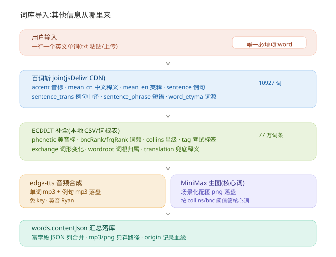
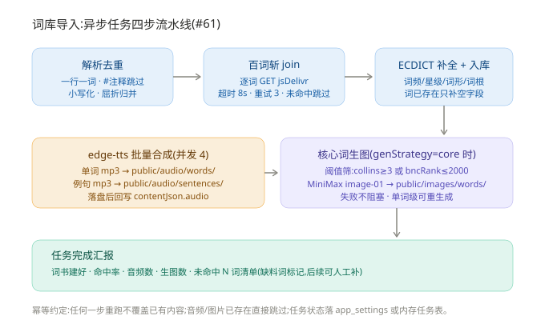
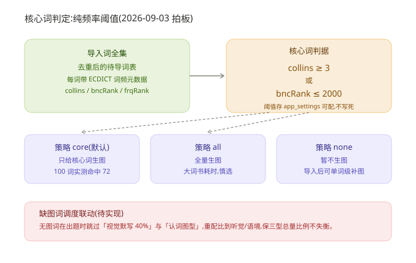
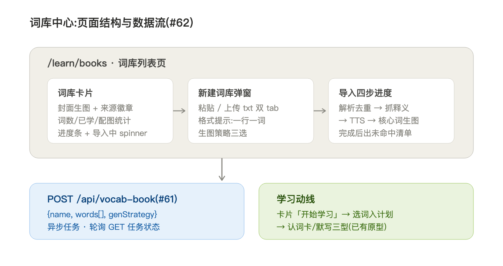

# 背单词 · 词库导入与词库中心设计（#61 / #62）

> 版本：v1.0 · 2026-09-03
> 状态：设计定稿，待实施
> 上游文档：`背单词数据模型设计.md`（三表 + contentJson 字段来源）、`背单词卡片交互设计.md`（学习侧交互）、`背单词素材收集方案.md`（数据源调研）
> 配图约定：本文所有图均为手写 SVG，存于 `docs/assets/vocab-import/`，任何 Markdown 预览可直接渲染，不依赖 mermaid

---

## 1. 目标与范围

把已跑通的 CLI 导入管线（`scripts/import-vocab-pipeline.mjs`）界面化，并给「不止一本词书」提供列表页：

| 任务 | 内容 | 载体 |
|---|---|---|
| #61 | 词库导入 API：POST 创建异步导入任务，四步流水线 | `/api/vocab-book` + 任务状态查询 |
| #62 | 词库列表页：词库卡片网格 + 新建弹窗 + 导入进度 | `/learn/books`（原型 `prototype/vocab/book-list/`） |

**用户视角的核心承诺**：导入时只给英文单词（txt 一行一词），其余信息（音标、释义、例句、音频、配图）全部自动补齐。

## 2. 词库导入：数据从哪里来

导入的唯一必填项是单词本身，其余字段按四层数据源自动补齐：



分层职责与字段映射（字段名沿用上游 schema，管线不做二次翻译）：

| 层 | 数据源 | 产出字段 | 说明 |
|---|---|---|---|
| ① 用户输入 | txt 粘贴/上传 | `word` | 一行一词，`#` 注释跳过，小写化、屈折形式归并去重 |
| ② 百词斩 join | `lyc8503/baicizhan-word-meaning-API`（jsDelivr CDN，10927 词） | `phoneticUk`、`contentJson.translation/definition/examples/exchange` | 展示型字段主力；未命中词跳过，重跑可补 |
| ③ ECDICT 补全 | 本地 CSV（codeload 源码包 + awk 抽行）+ wordroot.txt | `phoneticUs`、`contentJson.bncRank/frqRank/collins/tags/exchange/root` | 元数据型字段；**核心词判据的前置依赖**；translation 列可作百词斩未命中时的释义兜底 |
| ④a edge-tts | 本地 Python CLI（免 key） | `contentJson.audio.word`、`examples[].audio` | 单词 mp3 + 例句 mp3，落 `public/audio/`，库内只存路径 |
| ④b MiniMax 生图 | `POST /v1/image_generation`（复用 config.json 的 llm.apiKey） | `contentJson.image` | 只跑核心词；png 落 `public/images/words/`；失败不阻塞导入 |

落库语义：

- 富字段合并进 `words.contentJson`（JSON 列），mp3/png 一律文件系统承载、库内只存路径
- `words.origin` 记录血缘：`baicizhan` / `ecdict` / `import` / `manual`
- 幂等：同词重导不覆盖已有内容（仅空字段补全）；同 bookId 重导清旧关联重挂

## 3. 导入 API 设计（#61）

### 3.1 接口

```
POST /api/vocab-book        创建导入任务 { name, words[], genStrategy: "core"|"all"|"none" }
GET  /api/vocab-book/task   轮询任务进度（页面导入弹窗用）
```

### 3.2 异步任务流水线

四步串行推进，每步幂等可续跑，TTS/生图失败只记数不中断：



实现要点（从 CLI 管线平移）：

- 解析去重：小写化、按行去重、屈折形式归并（`abandoned`→记录原形 `abandon`，例句挖空判分时屈折/原形双答案，见交互文档 §2.3）
- 百词斩 join：逐词 GET，超时 8s + 重试 3 次 + 404 跳过；文件名特殊字符替换 `_`
- ECDICT 补全：**不走 Node 流式解析大 CSV**（已踩坑），维持 awk 预抽取小文件路径；界面化后可预建「word→ecdict 行」本地索引
- 音频：并发 4，已存在且 >1KB 直接跳过；edge-tts SSL reset 退避重试
- 生图：`genStrategy` 三选一（见 §4）；单词级重生成走已有 `/api/vocab-image`
- 任务汇报：完成时返回命中率、音频数、生图数、**未命中 N 词清单**（缺料词标记，后续可人工补释义/例句）

### 3.3 未命中词的处理

百词斩只有 1 万词，用户自建词书可能含生僻词。分级兜底：

1. 音标/释义：ECDICT `phonetic` + `translation` 列兜底（当前 CLI 未启用，#61 补上）
2. 例句：无兜底源（schema 允许多条，后续可人工补或 LLM 生成，本期不做）
3. 导入完成汇报中显式列出未命中词，不让缺料静默发生

## 4. 核心词判定与生图策略

2026-09-03 拍板：**纯频率阈值，不做 LLM 可图化细筛**。



- 判据：`collins ≥ 3` 或 `bncRank ≤ 2000`（100 词实测覆盖 72 词）
- 阈值存 `app_settings`，设置页可改，不写死
- 生图策略三选（导入弹窗内）：`core`（默认）/ `all` / `none`
- **缺图词调度联动（待实现）**：无图词出题时跳过「视觉默写 40%」与「认词图型」，把比例重配到听觉/语境，保三型总量不失衡。这是导入完成后影响学习侧的唯一联动点，#61 交付时如未实现，需在词书页给出「存在 N 个无图词」提示

## 5. 词库中心页面（#62）

原型已定稿：`prototype/vocab/book-list/index.html`（麦田琥珀主题）。页面结构与数据流：



- 卡片：封面生图 + 来源徽章（内置/自定义/导入中）+ 词数/已学/配图统计 + 进度条；导入中的书显示 spinner 态
- 新建弹窗：粘贴 / 上传 txt 双 tab；格式提示「一行一词、# 注释、屈折自动归并」；生图策略三选
- 导入进度：四步 stepper，对应 §3.2 流水线，完成后展示未命中清单
- 数据对齐：`word_books.book_id / name / description / source` 已备齐卡片所需字段

## 6. 实施顺序

1. **#61** 导入 API：把 CLI 管线搬进 Next.js 异步任务（POST + 轮询），补 ECDICT 释义兜底与未命中清单
2. **#62** 列表页：按原型落 `/learn/books`，接 #61 的创建/轮询接口
3. 阈值 `app_settings` 落库 + 设置页配置项
4. 缺图词调度联动（可独立成任务）

## 7. 版本记录

| 版本 | 日期 | 变更 |
|---|---|---|
| v1.0 | 2026-09-03 | 初稿：四层数据源、导入 API 四步流水线、核心词阈值、词库中心页面结构定稿；配 4 张 SVG |
